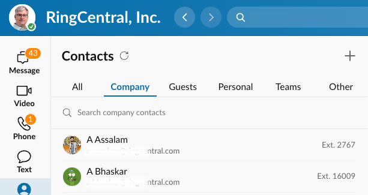

# Introduction to the Address Book API

One's RingEX™ company directory and personal address book is accessible via a set of APIs. These APIs can be used to facilitate contact synchronization, and employee or contact lookups. 

Within RingCentral contacts are divided into two primary categrories:

* Internal contacts
* Personal/external contacts

## Internal contacts

Internal contacts refers generally to the set of contacts input into RingCentral from your company's LDAP or directory server. The contacts that appear here are managed by external processes and systems. No REST APIs exist that allow you to add contacts to your company's directory. 

However, you can use REST APIs to perform the following functions:

* [Search](https://developers.ringcentral.com/api-reference/Internal-Contacts/searchDirectoryEntries) your company's directory
* [Iterate over a list](https://developers.ringcentral.com/api-reference/Internal-Contacts/listDirectoryEntries) of all contacts in the directory
* [Retrieve details](https://developers.ringcentral.com/api-reference/Internal-Contacts/readDirectoryEntry) relating to a specific contact in the directory

Furthermore, if your account belongs to a related list of federated accounts, there are APIs to discover the [other accounts](https://developers.ringcentral.com/api-reference/Internal-Contacts/readDirectoryFederation) which may also contain their own distinct directories you can independently search. 

<figure markdown>
  
  <figcaption>Your Company directory as seen from within the RingCentral app</figcaption>
</figure>

### Tips on filtering your company directory

Most are likely to be overwhelmed by the number of contacts in their company's directory, so we suggest filtering contacts as needed to present end users with a more relevant set of contacts. 

#### Filtering by a site

For large companies, especially those scattered across multiple geographies, RingCentral supports the concept of a "site." Each site is its own unique administrative domain, with permissions that allow some to operate across sites, and to restrict others to a single site. 

Developers can use the `siteId` request parameter to filter by a specific site. 

```http
GET /restapi/v1.0/account/~/directory/entries?siteId=ATL
Content-Type: application/json
Authorization: Bearer <access-token>
```

#### Filtering by extenstion type

A predefined list of extension types are available for filtering. We recommend using the following predefined types of extensions to be fetched. Types must be declared exactly as written below, and developers are free to filter by multiple types. When filtering by multiple extension types, the result will contain a union of all extensions of all matching types. 

| Type               | Description          |
|--------------------|----------------------|
| `User`             | User extension       |
| `Department`       | Department extension |
| `Announcement`     | Announcement Only    |
| `Voicemail`        | Voicemail Only       |
| `SharedLinesGroup` | Shared Line Group    |

```http
GET /restapi/v1.0/account/~/directory/entries?type=Department&type=User&type=Announcement&type=Voicemail&type=SharedLinesGroup
Content-Type: application/json
Authorization: Bearer <access-token>
```

### Filtering out un-activated accounts

Some extensions in RingEX will be inactive. This means the extension exists, but the user has not yet activated the extension for use. These extensions are returned in the corporate directory and should be filtered from the address book as they are not needed by contact centers.

To filter unactivated extension, first search for records where `status` is `NotActivated`. Then filter these records out from the results you receive when calling [Get Company Directory Entries](https://developers.ringcentral.com/api-reference/Internal-Contacts/listDirectoryEntries).

### Hiding entries within your company directory

There might be a need to exclude some UCaaS Users entirely, or their specific numbers, from the RingEX™ directory, to prevent customer calls to be transferred to them by mistake. With RingCentral, it is possible to hide certain extensions from being visible in the RingEX™ directory.

As an Account Admin, go to the [RingCentral Service Web](https://service.ringcentral.com/) and configure what contact information should be hidden in the Company Directory for each User. There are 3 options for such configuration:

* Hide Mobile Phone number (only Mobile number will be hidden in Corporate Directory)
* Hide Contact Phone number (only Contact number will be hidden in Corporate  Directory)
* Hide the entire User (User will be completely removed from Directory, including his/her contact information, contact numbers, DID, DL numbers, etc).

You can find user settings under **Users** tab->**Select a username**->**User Detail** Row->**General** tab.

{class="img-fluid" style="max-width:428px"}

## External or personal contacts

Each user within a RingCentral account can maintain their own independent list of personal contacts. These contacts are unique to each user, and there are a set of REST APIs that allow one to fully manage the personal contacts of any user within your account. 

The RingCentral REST APIs let developers do the following vis-a-vis personal contacts:

* List personal contacts
* Create or update a personal contact
* Create contacts in a batch
* Retrieve a personal contact
* List and manage favorite contacts

The [API Reference](https://developers.ringcentral.com/api-reference/External-Contacts/listContacts) can provide you with more detailed information on the above APIs. 

!!! warning "Limits on address book size"
    Each user is limited to an address book of a maximum of 10,000 records. 

