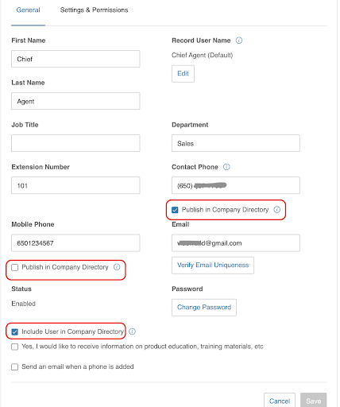

# Introduction to Address Book

The RingCentral RingEX™ directory is accessible via a set of APIs to be accessed by external vendor systems and consists of the complete set of all extensions that are created on the RingCentral Unified Communication as a Service (UCaaS) site.

For most users, the entire corporate directory is accessible, but there are times you will need to filter the list numbers in the address book, especially for contact center partners.

## Examples of When to Filter the Address Book

Sometimes an agent will initiate a transfer upon connecting with a customer. The agent may determine the customer needs to be connected with a back-office employee. To find the right destination, the agent uses the address book to look up the back-office employee. There are 3 types of transfers that can occur.

1. **Conference Call** - the agent decides to connect the customer and the back-office employee on a conference call.
2. **Warm Transfer** - the agent puts the customer on hold and connects with the back-office employee. The agent and back-office employee have a discussion without the customer. When ready, the agent completes the transfer by connecting the customer to the back-office employee and the agent drops from the call.
3. **Blind Transfer** - the agent decides to connect the customer with the back-office employee. The agent disconnects from the call while the customer waits on the line to be connected to the back-office employee.

## Filtering Options

Most customers will be overwhelmed with the number of contacts to sort through in the address book, so we suggest filtering on the vendor side to enable customers control over their address book entries to avoid undesired extensions. There are a few different approaches to filtering.

### SiteID Filtering

Suppose a customer has two sites: one in Atlanta and one in Paris, with its own contact center and back-office. On the RingCentral side it is possible to limit extensions in the RingEX™ directory by siteID.

```http
GET /restapi/v1.0/account/~/directory/entries?siteId=ATL
Content-Type: application/json
Authorization: Bearer <access-token>
```

### Extension Type Filtering

A predefined list of extension types are available for filtering. We recommend using the following predefined types of extensions to be fetched. Types must be declared exactly as written below.

!!! Note
    You can specify multiple values for selection. Please see example for details.

| Type | Description |
|-|-|
| `User` | User extension |
| `Department` | Department extension |
| `Announcement` | Announcement Only |
| `Voicemail` | Voicemail Only |
| `SharedLinesGroup` | Shared Line Group |

#### Example
```http
GET /restapi/v1.0/account/~/directory/entries?type=Department&type=User&type=Announcement&type=Voicemail&type=SharedLinesGroup
Content-Type: application/json
Authorization: Bearer <access-token>
```

### Directory Control Filtering

There might be a need to exclude some UCaaS Users entirely, or their specific numbers, from the RingEX™ directory, to prevent customer calls to be transferred to them by mistake. With RingCentral, it is possible to hide certain extensions from being visible in the RingEX™ directory.

As an Account Admin, go to the [RingCentral Service Web](https://service.ringcentral.com/) and configure what contact information should be hidden in the Company Directory for each User. There are 3 options for such configuration:

* Hide Mobile Phone number (only Mobile number will be hidden in Corporate Directory)
* Hide Contact Phone number (only Contact number will be hidden in Corporate  Directory)
* Hide the entire User (User will be completely removed from Directory, including his/her contact information, contact numbers, DID, DL numbers, etc).

You can find user settings under **Users** tab->**Select a username**->**User Detail** Row->**General** tab.

{.img-fluid}

### Not Activated Account Filtering

Some extensions in RingEX will be inactive. This means the extension exists, but the user has not yet activated the extension for use. These extensions are returned in the corporate directory and should be filtered from the address book as they are not needed by contact centers.

To filter unactivated extension, search for records where:

```json
"status": "NotActivated",
```

Remove these records from the response you receive from using the [Get Company Directory Entries](https://developers.ringcentral.com/api-reference/Internal-Contacts/listDirectoryEntries).
