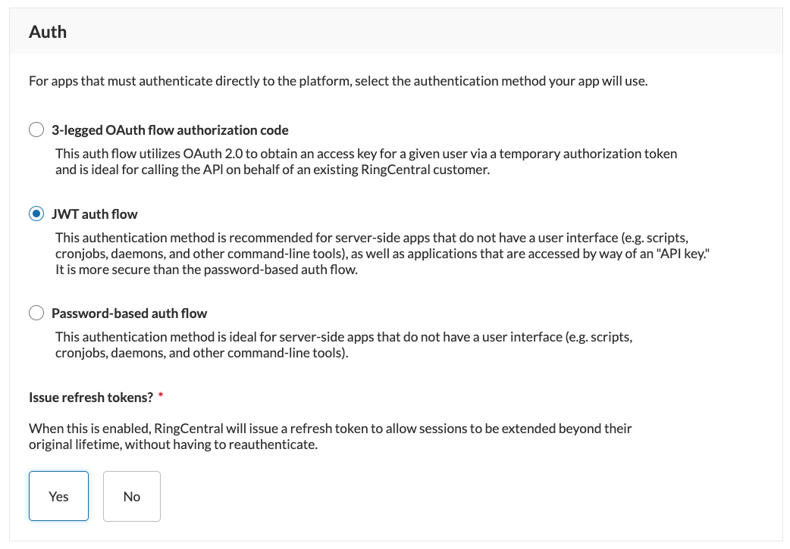

# Configuring apps to use JWT

To use a JWT, the app you wish to present your JWT credentials to must first be configured to accept JWT tokens as a means of authentication. To configure an app for JWT authentication, follow these steps:

1. Login to the [RingCentral Developer Console](https://developers.ringcentral.com/my-account.html). 
2. Select "Apps" from the left-hand navigation.
3. Click "Create App."
4. Select the "REST API App" app type, and click Next.
5. Under the "Auth" section of the subsequent screen, select "JWT auth flow."
6. Save and create the app.

{class="img-fluid" style="max-width:500px"}

## How do I create a JWT for an app?

A common misunderstanding is that one needs to generate a JWT for an app. That is true in a way, but JWTs are not directly associated with an app. Instead, JWTs are associated with users. That way, when a JWT is presented to an app, the platform has a way to evaluate whether the credentials used to make the API call possess the permission to perform that action. 

Therefore, to [create a JWT](../../getting-started/create-credential.md) start by logging into the Developer Console, clicking your name in the upper-righthand corner, and selecting "Credentials."

{class="img-fluid" style="max-width:300px"}

### Selecting and creating JWT credentials

The JWT authentication method is intended for server-to-server use cases. There is a strong temptation among developers to adopt JWT for user auth because it is perceived as much easier to use and maintain. However, if you find yourself wondering how you will create JWT credentials for all of your users, then chances are JWT is *not* the right authentication model for you. 

A common design pattern in server-to-server use cases is to provision a user or extension that is dedicated to a specific application. This type of user is often called a "service user." A service users can then be setup with only the access they require, and can be relied upon to be more persistent and resilient to changes in your org chart. For example, imagine that Priya used her JWT credential to connect to RingCentral, but that one day Priya leaves the company and IT disables her account. In that moment, any app using her JWT credential will cease to operate. A service user, because that are not bound to an employee, helps mitigate the risk of that kind of change. 
