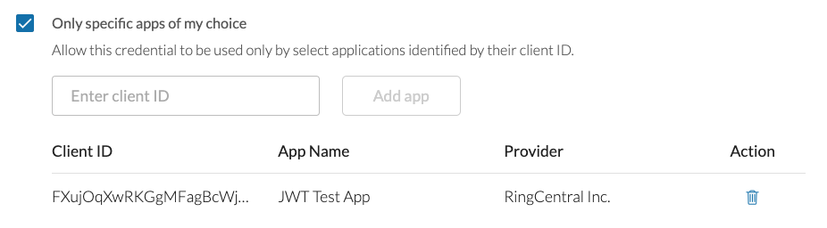

# Using JWT to help customers connect to an application

JWT credentials provide developers building applications for the RingCentral App Gallery a way to help connect customers with their application. Once upon a time this was done in the following (and now discouraged) way:

1. Application provider would instruct customer to login to the Developer Console and create an app with specific URLs and permissions. 
2. Customer would provide application provider with a client ID, and client secret for the app they created. 
3. Customer would provide application provider with a username and password to login to the app they created. 
4. Application provider would store client ID, client secret, username and password in their system in order to access customer's account. 

The above technique was necessary because the password grant type was only permitted to be used with private applications, and developers often felt that the password grant type provided them with a more reliable way to access a customer's account. 

The introduction of JWT credentials renders this process obsolete and is actively discouraged as it is fundamentally very insecure. 

## How to connect to a public app using JWT authentication

Application providers can provide customers with access to the applicatons they build using the following process and methodology.

1. Application provider creates a public app with all the proper settings and set to use JWT auth.
2. Application provider instructs customer to create a JWT credential via the Developer Console that can only be used by the application provider's application.
3. Application provider prompts the customer to copy and paste the newly created JWT credential into a web form so that is can be stored for re-use later by the application provider. 

If successful, the customer would see something like the following for the JWT they created.

{class="img-fluid" style="max-width:500px"}

So how does this work exactly? 

The key to understanding this flow rests in understanding how client and user credentials are used to facilitate connecting to the RingCentral Platform. Every app without exception must present its own client ID and secret when connecting to the platform. This is necessary so the platform knows how to communicate with the application being interacted with, as well as to enforce any permissons or other policies set by the developer. 

Then in addition, a user's credentials are presented to the platform so that RingCentral knows whose account the application is acting within or upon. In this way every call to the RingCentral API can be described in the following way:

> The application FOO called the endpoint /restapi/v1.0/status on behalf of ACCOUNT/PERSON

JWT credentials can be restricted to an application, but that does not mean that the application in question owns the JWT credential it is associated with. JWT credentials are owned exclusively by the user that created them, and only that user can determine which apps are permitted to use their credential. 

!!! tip "How does the platform know which app a JWT credential is used to connect to?"
    The JWT grant type used to powered JWT credentials still utilizes the OAuth authorization flow. In this flow, a JWT credential is presented to the platform with an app's client ID and secret. The platform then responds with an access token that the application then uses to call the API. The access token is specific to a credential and app pairing. That way when an access token is presented to the platform, the platform can look up the application it is associated with. 
	
## Helping customers provision a JWT credential for your application

If you are an application provider wishing to setup a server-to-server communication between your service and a RingCentral customer's account, then JWT authentication is a perfect way to facilitate that. In order to connect to a customer's account, they will need to create a JWT credential and transmit it to you. 

Once they send you the credential they have created, you will need to store it in your system so that you can use it to authenticate to their account. 

The customer, when creating the JWT credential, must specifically grant your application permission to use the credential. This is done by having them select "Only specific apps of my choice" under "who is permitted to use this credential?" And then having the customer enter in the Client ID of your application is the appropriate field. 

To streamline this process and help the customer create a JWT credential restricted to your application, you can use the link pragma below:

```
https://developers.ringcentral.com/console/my-credentials/create?client_id=<ENTER YOUR CLIENT ID>
```

Then, create a button your application that prompts the user to create a JWT token at RingCentral using the link above. Then instruct them to copy and paste the credential created and send it to you. 
