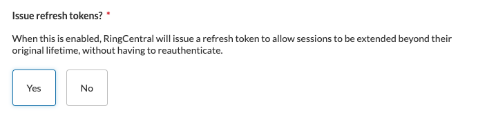

# Using refresh tokens to generate new access tokens

Developers should be aware that access tokens expire over time. As a result, your application will lose access to your customer's account data, and your users will need to go through the authorization process again unless you take measures to keep their access tokens live by refreshing them via the [refresh token operation](https://developers.ringcentral.com/api-reference/Get-Token#section-refresh-token-flow).

Access tokens and refresh tokens usually expire according to the following schedule:

| Token | Time to live |
|-|-|
| Access token | 1 hour |
| Refresh token | 7 days |

??? hint "Make sure your app is configured to issue refresh tokens"
    Before you proceed, make sure your application's settings have the "Issue refresh tokens" option enabled. By default, refresh tokens are not issued, so if you observe that a refresh token was not returned along with access token, edit your app's settings and look for the following:
    
    

## Using refresh tokens

Here are a few things to keep in mind when using refresh tokens to generate new access tokens.

* Refresh tokens are transmitted to developers with their corresponding access tokens.
* Refresh tokens can only be used once. 
* A new refresh token is usually generated when the access token is refreshed. 
* Upon refreshing an access token, the previous access token is invalidated immediately. If the previous access token is used after successful refreshment, the API responds with an HTTP 401 status code that indicates authorization failure (specific error code may vary).
* If the app uses the newly generated access token, the previous refresh token will become invalid in approximately ten seconds. Within those ten seconds, one can refresh the access token multiple times, however, the same access token will be returned. After approximately ten seconds, attempts to re-use the refresh token will result in an error. 
* If the app doesn't use the newly generated access token, the old refresh token remains valid for up to 60 minutes. The app can send a refreshment request with the same refresh token multiple times, but the same access token will be returned (until it is used for the first time). 

!!! hint "The JWT auth flow provides non-expiring auth credentials"
    The [JWT auth flow](jwt-flow.md) is ideal for apps that lack a front-end user interface. Through the JWT auth flow, access tokens are still issued, but they are easily refreshed without the need for human interaction.

!!! info "How to keep access tokens fresh"
    - It is recommended to use the access token creation time and the `expires_in` value returned to store expiration time along with the access token. Before each use of access token the app should analyze if it is close to expiration and issue a refreshment request.
    - For multithreaded apps that use the same access token in multiple threads, it is recommended to implement a separate service dedicated to refreshing access tokens to prevent race conditions. This service can use the same approach to refresh tokens that are close to their expiration to ensure that your application never loses access to a user's account data and requires them to re-login. 

### Refresh access token request

!!! tip "Special considerations for client-side web apps"

    Pay close attention to the following for REST API apps with the app type of "Client-side web app":
	
	* An `Authorization` header is not transmitted in the refresh token request in order to keep the app's client secret hidden from the request/response
	* The app's `client_id` should be transmitted in the refresh token request body.

**HTTP Headers**

| Header           | Value                                                      |
| ---------------- | ---------------------------------------------------------- |
| `Content-type`   | `application/x-www-form-urlencoded`                        |
| `Authorization`  | Only required if app type is not "Client-side web app." Must be equal to `Basic ` + base64_encoded( Client ID + ":" Client Secret ) |

**POST Parameters**

| Parameter       | Type   | Description |
| --------------- | ------ | ----------- |
| `grant_type`    | string | Must be equal to `refresh_token`. |
| `refresh_token` | string | Required. The refresh token corresponding to the access token you want to refresh. |
| `client_id`     | string | Only required if the corresponding app type is "Client-side web app." |

**Example request**

```http
POST /restapi/oauth/token HTTP/1.1
Accept: application/json
Content-Type: application/x-www-form-urlencoded

refresh_token=BCMDFUMDRKV1MwMXx5d5dwzLFL4ec6U1A0XMsUv935527jghj48
   &grant_type=refresh_token&client_id=adsadsadsadadsad
```

### Refresh access token response

```http
HTTP/1.1 200 OK
Content-Type: application/json

{
    "access_token" : "U1BCMDFUMDRKV1MwMXxzLFSvXdw5PHMsVLEn_MrtcyxUsw",
    "token_type" : "bearer",
    "expires_in" : 7199,
    "refresh_token" : "U1BCMDFUMDRKV1MwMXxzLFL4ec6A0XMsUv9wLriecyxS_w",
    "refresh_token_expires_in" : 604799,
    "scope" : "AccountInfo CallLog ExtensionInfo Messages SMS",
    "owner_id" : "256440016"
}
```
