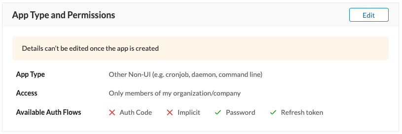

# Creating an Application

To create and register your RingCentral application, start by [signing in](https://developers.ringcentral.com/login.html#/) to the RingCentral Developer Console with your account login and password. If you do not have RingCentral account, please sign up.

After you login you will be taken to the Apps Console where all of your apps are listed and can be managed. Click the "Create App" button.

!!! note "Permission Required"
    If you see the "Create App" button, but it is disabled, then your account lacks the permission required to create an app. Contact your account's administrator to request this permission.

Upon clicking "Create App" you will be asked a number of questions to configure your app properly. 

## Select your app type

RingCentral allows developers to create a number of different types of apps. Each type may expose different configuration options and/or capabilities specific to that app. The two app types we currently support are:

* **API App for RingCentral MVP™** - this is by far the most common type of app created by developers as it gives developers generalized access to our wide selection of APIs available across our MVP™ product-line (voice, SMS, meetings, team messaging, call logging, call control, etc.)

* **Messaging Bot** - this refers to a special kind of app known as a "bot" used within RingCentral's team messaging product called Glip. 

### Where will you be calling the API from?

How your app will authenticate itself to the platform will depend upon the architecture and nature of your application. By telling us how and where the RingCentral API will be called, we can better secure your application and guide you towards the best authentication methodology to use. Here are your options:

| Type | Description | Supported Auth Modes | 
|-|-|-|
| **Web server** | This is the most common setting and refers to apps that adhere to a traditional client-server relationship, in which API calls to RingCentral are made from a server. | Auth code, Refresh token |
| **Web browser** | This is for "single-page apps" or those that utilize a pure client-side implementation with no server-side component. | Auth code, implicit grant, refresh token |
| **Android** | For mobile apps built natively for Android. | Auth code, password, refresh token |
| **iOS** | For mobile apps built natively for iOS devices, e.g. iPhone | Auth code, password, refresh token |
| **Windows Desktop** | For downloadable apps built for Windows. | Auth code, password, refresh token |
| **Mac Desktop** | For downloadable apps build for Macs. | Auth code, password, refresh token |
| **Other Non-UI** | For apps that run via the command-line. | Password, refresh token |

## App Access

RingCentral can enforce an access policy on behalf of its developers. RingCentral supports the following access policies.

| Access Level | Description |
|-|-|
| **All RingCentral Customers** | This makes your application available to the entire RingCentral ecosystem of customers, including those customers of our brand partners. We often refer to these apps as "public." |
| **Only members of my organization/conpany** | This restricts access to your app to only users belonging to your RingCentral account. We often refer to these apps as "private." |
| **Only customers of selected brand partners** | This restricts access to your app to only select brand partners. |

!!! tip "Expand the reach of your application!"
    RingCentral works with a number of partners who white-label the RingCentral platform for their respective markets. Our partners include BT, Telus, Avaya and AT&T. [Learn more about about building apps for these partners &raquo;](../partner-compatibility/)

## Will you be promoting your app?

To better support our developers wishing to promote their application to our customers, we ask if you intend to [promote your app in our App Gallery](../app-gallery/). *Your answer is for internal-use only.*

!!! warn "You cannot edit all fields after your app has been created."
    For security reasons, various properties of your app will become locked once it has been created. Therefore, before you proceed, please verify that your app is compatible with your desired authentication method.
    
    

## App Properties and Scope

Finally, fill in the other properties of your app. 

| Field | Description | 
|-|-|
| **Application Name** | Enter the name of your app. This name will be displayed to your users during authorization. |
| **Organization Name** | Enter the name of your organization. This name will be displayed to your users during authorization. You will only prompted for this the first time you create an app. | 
| **App Description** | Enter the text describing your app which is needed for app graduation only and will *not* be displayed to your app users. It should contain minimum 20 characters. |
| **App Permissions** | Enter the permissions, or "app scope" your app will require. This will restrict what APIs your app will have permission to call, and can protect your app from mis-use or abuse. |
| **URLs** | You may need to register a set of URLs for your app to facilitate a secure authorization process. | 

## What next? Code your app...

With your application having been created, you are now ready to begin building your app. Make note of your app's Client ID and Client Secret as you will need these when authenticating your app to the platform.

To help you get started, considering using one of the following Quick Starts:

* [SMS](../../sms/quick-start/)
* [Fax](../../fax/quick-start/)
* [Voice](../../voice/quick-start/)
* [Meetings](../../meetings/quick-start/)
  
