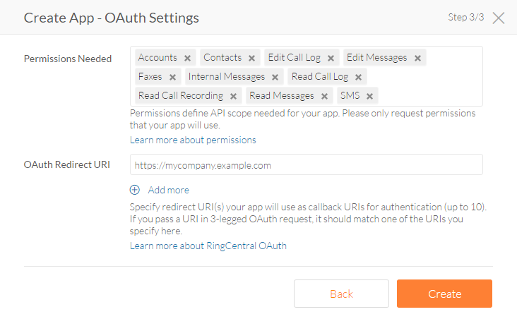

# Creating an Application

To create and register your RingCentral application, start by [signing in](https://developers.ringcentral.com/login.html#/) to the RingCentral Developer Portal with your account login and password. If you do not have RingCentral account, please sign up.

After you login you will be taken to the Apps Console where all of your apps are listed and can be managed. Click the "Create App" button.

!!! note "Permission Required"
    If you see the "Create App" button, but it is disabled, then your account lacks the permission required to create an app. Contact your account's administrator to request this permission.

Upon clicking "Create App" you will be asked a number of questions to configure your app properly. 

## General Settings

  
| Field | Description | 
|-|-|
| **Application Name** | Enter the name of your app. This name will be displayed to your users during authorization. |
| **Organization Name** | Enter the name of your organization. This name will be displayed to your users during authorization. You will only prompted for this the first time. | 
| **Description** | Enter the text describing your app which is needed for app graduation only and will *not* be displayed to your app users. It should contain minimum 20 characters. | 
    
## App Type & Platform

#### Application Type

Specify the application type. Please take time to specify correct value as it is not editable after your app is created and affects Authorization flows available for your app.

You can choose one app type out of two:

* **Private** - if you are developing an app for your own RingCentral account use;

* **Public** - if you are developing an app for many RingCentral accounts.

!!! note "Changing Application Type"
    Once you choose your application type you cannot change it yourself. If you'd like to move from a private app to a public app, please email: [devsupport@ringcentral.com](mailto:devsupport@ringcentral.com).

#### Platform Type

Select the application type from the list. Please take time to specify correct value as it is not editable after your app is created and affects Authorization flows available for your app.

You can select one platform type from the list:

| Type | Description |
|-|-|
| **Mobile (iOS/Android/Other)** | Native and hybrid mobile apps for iOS, Android and other mobile platforms. |
| **Desktop (Mac/Windows/Other)** | Installable desktop apps including Windows, Mac and others. This includes Chrome apps. |
| **Browser-based** | In-browser, client-side apps that communicate with RingCentral APIs on the client, e.g. client-side JavaScript. |
| **Server/Web** | Web-based apps are apps that communicate with RingCentral APIs from the server, e.g. Node.js,cPHP / Laravel, Ruby on Rails, etc. |
| **Server/Bot** | Chat bot apps built for Glip that communicate with RingCentral APIs (including Glip API) from the server side and can be running on your private or public network | 
| **Server-only (No UI)** | If your app does not have any user interface please pick this option. |

#### Authorization Flows

This field is not editable, but rather discloses what authorization and authentication modes are available to your application based upin the Application Type you selected.

## OAuth Settings

Select the permissions useful for your app from the drop-down list. And if your app will use Authorization Code Flow, specify the OAuth Redirect URI. Click the 'Create' button.

## Code Your App

With your application having been created, you are now ready to begin building your app. Make note of your app's Client ID and Client Secret as you will need these when authenticating your app to the platform.

To help you get started, considering using one of the following Quick Starts:

* [SMS](../../sms/quick-start/)
* [Fax](../../fax/quick-start/)
* [Voice](../../voice/quick-start/)
* [Meetings](../../meetings/quick-start/)
  
