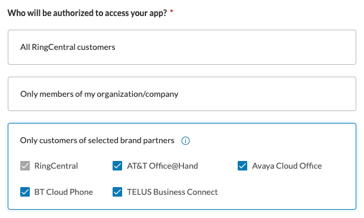

# Building for the RingCentral partner ecosystem

RingCentral works with a number of carriers, service providers, and partners to deliver a cutting edge cloud communications service directly to their customers. When you build apps and integrations for RingCentral, you are not only building for RingCentral customers, but to all the customers within our partner system, including customers for:

* AT&T
* Verizon
* Vodafone
* BT
* and many more global and international brands

From a technical perspective, apps built for RingCentral are inherently compatible with these other partners and brands. However, developers and marketing teams may wish to better understand and adhere to our best practices, including how to operate within our [segregated environments](../partners/segregated-environments/), in order to better market and sell into these customer segments. 

## Benefits of working with RingCentral partners

In this section, you will learn how to build apps that are optimized for our partner ecosystem. Here are the benefits of implementing and following this additional guidance:

1. Extend the reach of your application to hundreds of thousands of potential customers.  

2. Our partners are often deeply embedded in different geographic markets which can help developers and companies grow their markets internationally. 

3. Our partners have active sales channels. Having your app listed in their app galleries helps their channels market and connect customers to your product. 

## How to make your app available to our partners

The first step in making your application available to our partner's customers is to set the proper access permissions when you initially create your app. There are two ways to make your app available to RingCentral brand partners when configuring "who will be authorized to access your app?" They are:

1. Select "All RingCentral customers." When this is selected, your app will be made available to all RingCentral customers, including those of our brand partners. If RingCentral were to add more brand partners, then your app will automatically be available to them as well. *This is the recommended option.*

2. Select "Only customers of selected brand partners," then select the specific brand partners you want to limit access to. For those wishing to maximize the reach of their application, we recommend selecting "All RingCentral customers."

## How to best promote your app to our partners

Each of our brand partners has an app gallery in which are promoted all of the apps available to their customers. Learn how to create a profile for your app that can be listed in these galleries.

Learn [how to get listed in our app gallery &raquo;](../app-gallery/)

## Understanding the additional requirements for AT&T Office@Hand and Verizon

Some partners operate in a completely segregated environment and as a result require developers to adhere to [additional technical requirements](../partners/segregated-environments/) in order to maintain compatibility with those partners. 

