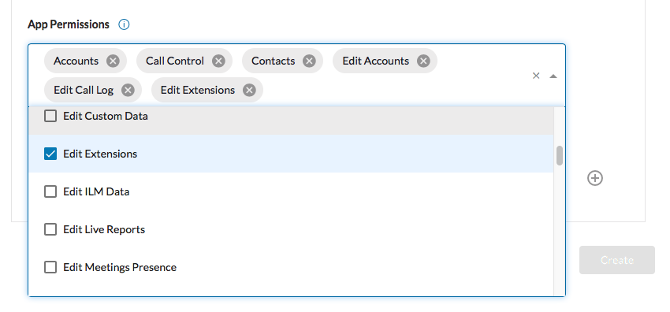
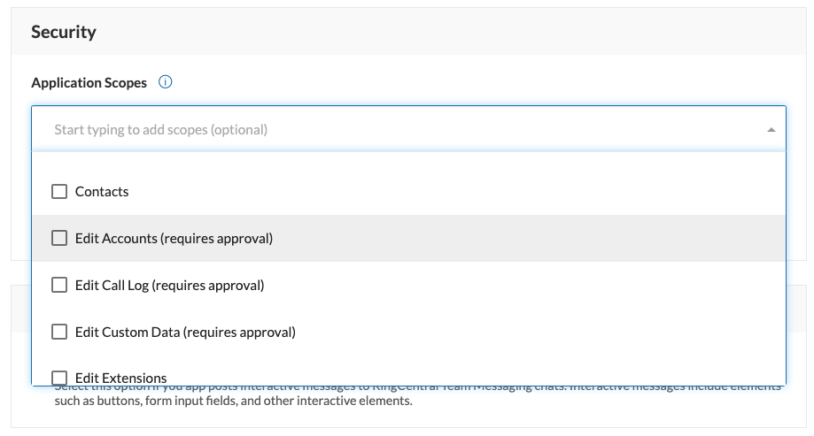

# Application permissions and scopes

In order to work with particular RingCentral API resources the application should have the corresponding scopes associated with it, also referred to as application "permissions." Required scopes are generally declared at the stage of application registration and confirmed by the user during the authorization stage of connecting to that application.

Adding and removing scopes is accomplished in the Developer Console by editing the application's settings. 

## Application vs user permissions

Setting an application's scope does not by itself confer upon a user of that application the ability to perform the associated action. Setting the scope merely declares that an application needs the ability to perform a specific action in order to function properly. Therefore, in order for a user of an application to perform a given operation, the app must declare the corresponding scope, and the user must have been assigned a role that possesses the corresponding user permission as well. 

## Requesting access to restricted app scopes

As you are adding scopes to your application, you may notice some scopes have the text "(requires permission)" next to them. This indicates an application scope that is restricted in some way, often for an abundance of caution and concerns for security. When you add a restricted app scope to your app, you will be prompted to provide a justification for why your app requires the ability to perform the actions associated with that app scope. Then, when you save the settings of that app, a request will be filed with the support to review your petition, and approve (or reject) your request accordingly. 

To maximize the likelihood of your request being approved, please provide a detailed, well-written response to the justification prompt. 

## Available application scopes

The following scopes are available:

| Permission                | Description                                                    | Access Type       | Included Permissions |
| ------------------------- | -------------------------------------------------------------- | ----------------- | -------------------- |
| **A2P SMS**               | Sending SMS messages in large numbers                          | Special operation |                      |
| **Accounts**              | Managing accounts: creating new accounts, viewing and updating account information, deleting existing accounts | CRUD | **EditAccounts** |
| **AI**                    | Analyze audio and text. Also supports view and update analysis info including speaker samples. | Read only         |                      |
| **Analytics**             | Access call analytics data via the Analytics product           | Read only         |                      |
| **CallControl**           | Manipulate and controls in progress                            | Special operation |                      |
| **Contacts**              | Creating, viewing, editing and deleting user personal contacts | CRUD              | **ReadContacts**     |
| **ControlWebinars**       |                                                                | Special operation |                      |
| **DirectRingOut**         | Performing direct (one-legged) ring-out phone calls. *Available on request.* | Special operation |                      |
| **EditAccounts**          | Viewing and updating user account info (including name, business name, address and phone number/account number) | Read and Update | **ReadAccounts**, **EditExtensions** |
| **EditCallLog**           | Viewing and updating user call logs                            | Read and Update   | **ReadCallLog**      |
| **EditCustomData**        | Viewing and updating client custom data (key-value)            | Read and Update   |                      |
| **EditExtensions**        | Viewing and updating user extension info (includes extension name, number, email and phone number, assigned phone numbers, devices and other extension settings) | Read and Update | |
| **EditMessages**          | Viewing and updating user messages                             | Read and Update   | **ReadMessages**     |
| **EditPaymentInfo**       | Viewing and updating account billing settings                  | Read and Update   |                      |
| **EditPresence**          | Getting and modifying user presence information                | Read and Update   | **ReadPresence**     |
| **EditReportingSettings** | Viewing and updating call reporting settings. *Available on request.* | Read and Update   |                      |
| **EditWebinars**          |    | Special operation |                      |
| **Faxes**	                | Sending and receiving faxes                                    | Special operation | **ReadMessages**     |
| **Glip**	                | Read and post message, read and manage chats                   | Read and Update   |                      |
| **InternalMessages**      | Sending and receiving intra-company text messages, a.k.a. pager messages | Special operation | **ReadMessages**     |
| **Meetings**              | Creating, viewing, editing and deleting meetings via RingCentral Meetings | CRUD   |                      |
| **NumberLookup**          | Looking-up and reserving available phone number                | Special operation |                      |
| **ReadAccounts**          | Viewing user account info (including name, business name, address and phone number/account number) | Read Only | |
| **ReadCallLog**           | Viewing user call logs                                         | Read Only         |                      |	 
| **ReadCallRecording**     | Downloading call recording content                             | Read Only         | **ReadCallLog**      |
| **ReadClientInfo**        | Viewing of client application registered attributes and additional helper information (external URLs, hints, etc.) | Special operation | |
| **ReadContacts**          | Viewing user personal contacts                                 | Read Only         |                      |	 
| **ReadMessages**          | Viewing user messages                                          | Read Only         |                      | 
| **ReadPresence**          | Getting user presence information                              | Read Only         |                      |
| **ReadWebinars**          |    | Special operation |                      |
| **RingOut**               | Performing two-legged ring-out phone calls                     | Special operation |                      | 
| **RoleManagement**        | Editing and assignment or user roles. *Available on request*   | Special operation |                      |
| **SMS**                   | Sending and receiving (SMS) text messages                      | Special operation | **ReadMessages**     |
| **SubscriptionWebhook**   | Subscribing to and managing webhook notification preferences   | Special operation |                      |
| **TeamMessaging**         | Post messages, as well as view, edit and delete Team Messaging related data |      |                      |
| **Video**                 | Creating, viewing, editing and deleting meetings via RingCentral Video | CRUD      |                      |
| **Voicemail**             | Delivering voicemail messages to multiple internal recipients  | Special operation |                      |
| **VoipCalling**           | Registering as VoIP device and making VoIP calls               | Special operation |                      |

