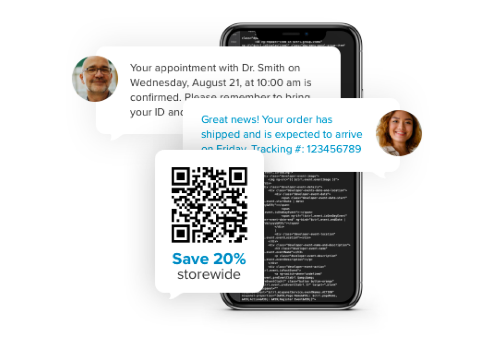
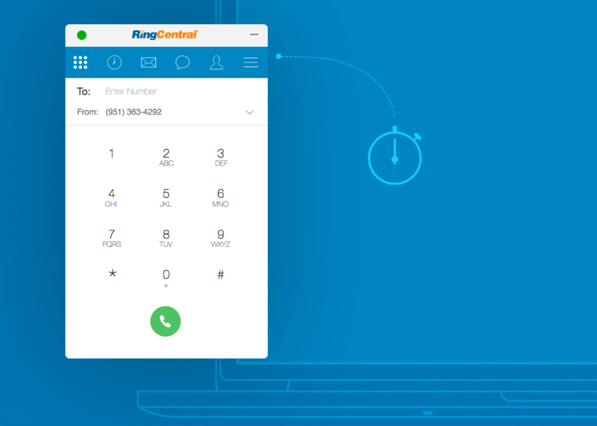
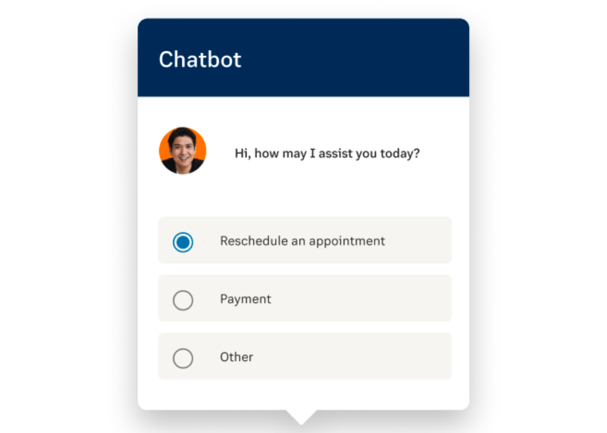

  <ol class="carousel-indicators">
    <li data-bs-target="#home-carousel" data-bs-slide-to="0" class="active"></li>
    <li data-bs-target="##home-carousel" data-bs-slide-to="1"></li>
    <li data-bs-target="##home-carousel" data-bs-slide-to="2"></li>
    <li data-bs-target="##home-carousel" data-bs-slide-to="3"></li>
  </ol>
  

    

	
  

    

      

        
      

      

        <h1 class="display-5 fw-bold lh-1 mb-3">Get started in minutes sending SMS messages</h1>
        
Get started using the RingCentral API by sending an SMS in minutes using our most popular quick start guides.

        

          <a href="messgaing/quick-start/" class="btn btn-primary btn-lg px-4 me-md-2">Get started</a>
        

      

    

  

    

    

  

    

      

        
      

      

        <h1 class="display-5 fw-bold lh-1 mb-3">Introducing the RingCentral Video Client SDK BETA</h1>
        
The RingCentral Video Client SDK allows developers to embed real-time video experiences directly into a web and/or mobile application.

        

          <a href="https://forms.gle/H3QxfhqAhujkktXa6" class="btn btn-primary btn-lg px-4 me-md-2 mr-3">Sign-up for the Beta</a>
          <a href="./video/client-sdk/" class="btn btn-secondary btn-lg px-4 me-md-2">Learn more</a>
        

      

    

  

    

    

  

    

      

        
      

      

        <h1 class="display-5 fw-bold lh-1 mb-3">Embed a fully-functional web phone into your website in minutes</h1>
        
RingCentral Embeddable helps developers embed a fully-functional RingCentral web phone into any web page or web application. Use the embeddable to make and receive calls, manage contacts, schedule meetings, and send SMS.

        

          <a href="https://developers.ringcentral.com/embeddable-voice.html" class="btn btn-primary btn-lg px-4 me-md-2">Get started</a>
        

      

    

  

    

    

  

    

      

        
      

      

        <h1 class="display-5 fw-bold lh-1 mb-3">Extend RingCentral app with custom functionality</h1>
        
Create and integrate custom functionality into RingCentral app to optimize key business processes, or engage with users more deeply.

        

          <a href="./team-messaging/add-ins/" class="btn btn-primary btn-lg px-4 me-md-2">Get started</a>
        

      

    

  

    

  <button class="carousel-control-prev" type="button" data-bs-target="#home-carousel" data-bs-slide="prev">
    
    Previous
  </button>
  <button class="carousel-control-next" type="button" data-bs-target="#home-carousel" data-bs-slide="next">
    
    Next
  </button>

