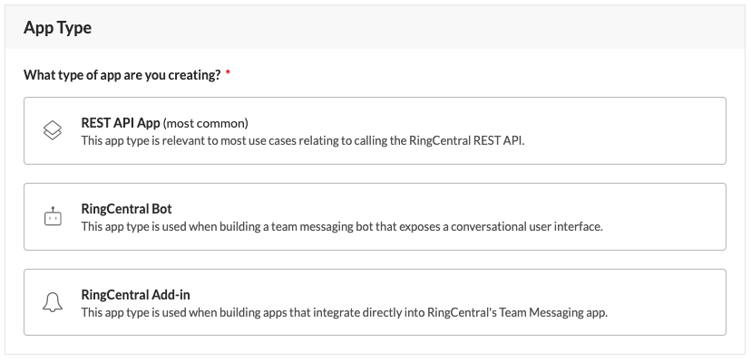
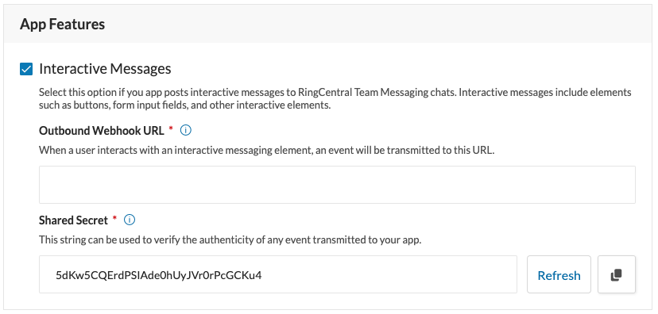
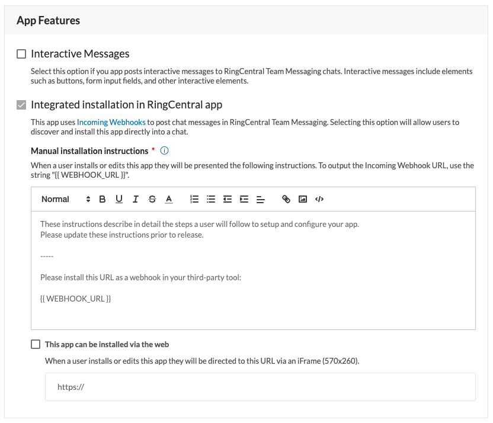

# Registering an application and obtaining app credentials

{! mdx_includes/first-api-call-reminder.md !}

Registering an application results in the platform provisioning to your application a set of credentials that will be used to identify your application on the network. Through the process of registration developers will also be given a way to configure their application so that the platform can support it successfully as it operates on our network. 

To register your application, start by [signing in](https://developers.ringcentral.com/login.html#/) to the RingCentral Developer Console with your account login and password. If you do not have RingCentral account, please sign up.

After you login you will be taken to the Apps Console where all of your apps are listed and can be managed. Click the "Create App" button found in the upper-right hand corner on the "Apps" tab.

??? note "Is the Create App button disabled?"
    If you see the "Create App" button, but it is disabled, then your account lacks the permission required to create an app. Contact your account's administrator to request this permission.

## What app type is best for you?

RingCentral allows developers to create a number of different types of apps. Each type may expose different configuration options and/or capabilities specific to that app. The two app types we currently support are:

* **REST API App** - this is by far the most common type of app created by developers as it gives developers generalized access to our wide selection of APIs available across our RingEX product-line (voice, SMS, meetings, team messaging, call logging, call control, etc.)

* **Bot Add-in** - this special kind of app known as a "bot" is used within RingCentral's team messaging product

* **Notification Add-in** (deprecated) - notification apps are a kind of add-in that routes event notifications from third-party systems into RingCentral's unified desktop application. This feature however is deprecated, and many developers may no longer have access to this application type. 

 

### Tell us about your application

Once you have selected your app type, next you need to provide some basic meta data about your app, like its name, icon, etc. Here are a few things to note about these fields.

* **App name** - this field is never displayed publically, and is a useful way to help you disambiguate between apps whose names are similar, e.g. "Foo App (staging)" vs "Foo App (qa)."

* **Display name** - this field is what is displayed publicly to users within the context of our applications, like our desktop client. 

* **App icons** - this field may or may not be required based upon the app's type. Add-ins and bots require an icon as these apps often publish messages inside our desktop client. 

* **Primary contact** - designate a individual to be responsible for receiving and responding to important communications relating to this app.

 

### Will you be promoting your app?

To better support our developers wishing to promote their application to our customers, we ask if you intend to [promote your app in our App Gallery](promote-app.md). *Your answer is for internal-use only.*

## Setup authentication

Select the authentication method your app will utilize to connect to the platform. We support two primary modes:

* **3-legged OAuth flow**. This method is used when your application needs to gain access to a user's RingCentral data, or needs to perform various actions upon that user's behalf. This flow requires that your app publish a user interface so that users can initiate the authorization process. 

* **JWT auth flow**. This method is easy to implement and is ideal for apps that run without a user-interface, e.g. a cron job, or a script. 

??? tip "What happened to the 'Password-based auth flow?'"
    The password grant type has been deprecated. Developers should use the JWT auth flow as a superior and more secure alternative to password based auth.

#### Should I enable refresh tokens?

Access tokens issued through the OAuth authorization flow expire automatically after a short period of time. Refresh tokens are used to keep access tokens you have stored locally active. If you desire users to authenticate once to your platform, and not be asked to login again, then you should enable refresh tokens.

When refresh tokens are enabled, an additional "refresh token" will be issued to your application. This token can be presented to RingCentral in order to obtain a new access token, which can then replace the previously issued access token. 

To keep access tokens from ever expiring, developers should implement a recurring background task that will wake up at leasrt once per day, iterate over all access tokens stored locally, and exchange their refresh token for a new access token. If this is reliably done, then users will not need to relogin because their auth session will remain fresh and active. 

## Configure your app's security settings

### Select the app scopes your application will utilize

Begin by selecting the application scopes your app will utilize. This effectively defines what actions your app will be permitted to perform. 

!!! tip "For security, request *only* permissions your application requires."

#### Adding scopes that require approval

Some app scopes may include the text "requires approval." These app scopes require approval because they will allow your application to perform sensitive operations. You are free to add these scopes to your app, and if you do, you will be required to provide an explanation and justification as to why your app requires the request functionality. Then, when you register your application, a support ticket will be filed automatically with the developer support team so that they can review and process your request. 

### Configure your app's access preferences

Next, determine who will have access to your application. The terms "public" and "private" in this context can sometimes lead to confusion. To clarify, in this context the terms "public" and "private" refer to whose credentials will be allowed to login to your application. 

#### Public apps

If your app is public then any RingCentral credential can be used to login to your application. Here are common circumstances for which an app should be public:

* You are a partner building an application that you will market and sell to RingCentral customers
* You are a developer building an application you intend to promote in our App Gallery
* You are a RingCentral Enterprise customer with a number of large number of sub-accounts, a.k.a. federated accounts

Public apps are subjected to greater scrutiny through the development process to ensure that RingCentral customers and their data are kept safe and secure.

#### Private apps

If your app is private then only credentials belonging to your account can be used to authenticate with your application. Private applications are the most common apps on the platform. Here are common scenarios for which a private app is most appropriate:

* You are building an app that is intended to be used exclusively by your company.
* You are using RingCentral as a communication platform, a.k.a. CPaaS ("Communication Platform as a Service")

??? tip "What is CPaaS?"
    CPaaS, which stands for Communication Platform as a Service, refers generally to a B2B2C design pattern in which RingCentral is provided communication services to you the developer, who in turn is leveraging those services to communication with their own customers (who may or may not be RingCentral customers themselves). 

#### What partners do I make my app available to?

If you are creating a public application that you intend to market and promote to RingCentral customers, then we strongly recommend you select "make available to all current and future RingCentral carrier and brand partners." Doing so will ensure your app will be promoted to the largest possible customer base around the world. 

Select "make available only to specific carrier and brand partners" only if your app should be restricted to be used with one partner or another. 

??? tip "Maximizing the reach of your application"
    RingCentral works with a number of partners who white-label the RingCentral platform for their respective markets. Our partners include BT, Telus, Avaya and AT&T. [Learn more about about building apps for these partners &raquo;](../basics/partners/index.md)

## Enable app features

Depending upon your application type, different app features will be made available to your application. 

### Interactive Messages

Interactive messages are a feature that allows applications to post messages into the RingCentral team messasing product that contain richly formatted content, and users can interact with using buttons, form elements, and more. Interactive messages are most often used by bots and add-ins. You will need to provide values for the following properties if this feature is enabled.

* **Outbound webhook URL.** This is the URL to which RingCentral will deliver events informing you when a user interacts with messages your application posts. 

* **Shared secret**. This is a string you should consider highly confidential, and will be used by your application to verify the authenticity of any event transmitted to your outbound webhook URL. 

 

### Integrated Installation

This feature is only available to "Notification add-ins" and is forcibly enabled. The feature defines for RingCentral how users will install your application. You must at least provide manual installation instructions to help users take the incoming webhook URL generated by RingCentral and install that URL into a target service being integrated with.

To maximize the number of people who will successfully install and use your application though, we recommend you implement a web interface that automates the installation process. If you select the "this app can be installed via the web," then the web interface you build will be presented within the RingCentral desktop app via an iframe to provide RingCentral users with a seamless installation experience.

 

## Obtaining your app's credentials

Upon clicking the "Create" button and successfully registering your application, your app will be provisioned app credentials in the form of a Client ID and Client Secret. You will use these credentials during the authorization process so that RingCentral can identify the app making API calls. 

## Next step: creating an authentication credential

Now that your application has been registered and you have obtained a client ID and secret, you will need to generate a credential to facilitate authentication so your app can call the API. In the next section you will learn how to generate a personal JWT token to help with auth.

<a class="btn btn-lg btn-primary" href="../create-credential/">Create a JWT credential</a>
  
