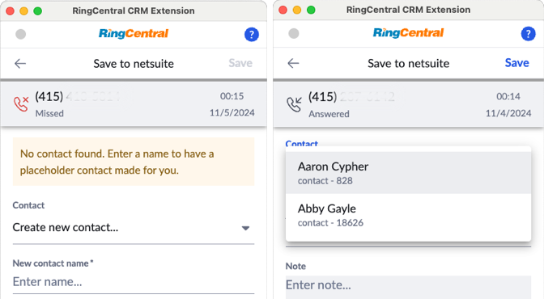

# RingCentral RingEX™ Developer Guide

  <h3>Developer Product Spotlight</h3>
  <h2>Embed a phone and log calls seamlessly in your CRM</h2>
  

    

      
    

    

      
RingCentral <a href="https://ringcentral.github.io/rc-unified-crm-extension/">App Connect</a>, powered by <a href="https://ringcentral.github.io/ringcentral-embeddable/">Embeddable 2.0</a>, is an all-in-one CRM integration solution. It embeds a full-featured communications client into almost any app, reliably logging all communications. Developers can easily integrate with both SaaS products and proprietary CRMs using a simple framework.

      <a class="md-button md-button--primary" href="https://ringcentral.github.io/rc-unified-crm-extension/">Get started</a>
    

  

Welcome to the RingCentral Developer Guide for RingEX. This guide, when used in combination with the [RingCentral API Reference](https://developers.ringcentral.com/api-reference/), provides the guidance and resources you need at every stage of your development journey. Whether you’re just getting started with the basics, looking to integrate core features quickly, or ready to build powerful add-ins and leverage advanced SDKs, this guide has you covered. Our goal is to help you navigate the RingCentral platform with ease, empowering you to create seamless, innovative communication experiences within your applications.

## Popular use cases

Explore these use cases for the RingCentral platform and API to learn how it can help your business. 

-   :material-run-fast:{ .lg .middle } __Call our REST API in 5 minutes__

    ---

    Get up and running quickly using this simple, guided quick start. 

    [:octicons-arrow-right-24: Try the Getting Started experience](#)

-   :material-cloud-circle:{ .lg .middle } __Integrate with any CRM__

    ---

    Use App Connect's innovative developer framework to quickly integrate with any CRM. 

    [:octicons-arrow-right-24: App Connect](#)

-   :fontawesome-solid-comment-sms:{ .lg .middle } __Send and Receive SMS__

    ---

    Stay connected and engaged with customers at scale through messaging automation.

    [:octicons-arrow-right-24: Send SMS](messaging/sms/sending-sms.md) [:octicons-arrow-right-24: Send images](messaging/sms/sending-images.d)

-   :material-history:{ .lg .middle } __Download and process call logs__

    ---

    Access the most thorough and detailed call logging API in the industry. 

    [:octicons-arrow-right-24: Process call logs](voice/call-log/index.md)

-   :material-transcribe:{ .lg .middle } __Access call transcripts__

    ---

    Access call transcripts, AI generate summaries, extracted action items, and more. 

    [:octicons-arrow-right-24: Access AI artifacts](ai/ringsense/index.md)

-   :fontawesome-regular-file-code:{ .lg .middle } __Embed RingCentral in any web app__

    ---

    Use RingCentral's Javascript phone to embed a feature-rich web phone and SMS client anywhere. 

    [:octicons-arrow-right-24: RingCentral Embeddable](#)

-   :material-application-braces:{ .lg .middle } __Build a RingCentral Add-in__

    ---

    Integrate third-party apps directly inside of RingCentral, a click away from every customer. 

    [:octicons-arrow-right-24: Adaptive Cards](team-messaging/add-ins/adaptive-cards.md)

-   :material-fax:{ .lg .middle } __Yes, fax is still a thing__

    ---

    In fact it is *huge*. Some of the largest industries still rely heavily on fax.

    [:octicons-arrow-right-24: Learn how process faxes](messaging/fax/sending-faxes.md)

-   :material-key:{ .lg .middle } __Choose the right auth type__

    ---

    Get help finding the right form of authentication is right for your app. 

    [:octicons-arrow-right-24: Access tokens](#) [:octicons-arrow-right-24: JWT](#) [:octicons-arrow-right-24: Help decide](#) 

-   :fontawesome-solid-bolt-lightning:{ .lg .middle } __Subscribe to realtime events__

    ---

    Receive events via webhook or web socket from all over the RingCentral ecosystem. 

    [:octicons-arrow-right-24: Webhooks](#) [:octicons-arrow-right-24: Web socket](#) [:octicons-arrow-right-24: All events](#)

## Explore our APIs

:octicons-organization-24: [__Account Management__](account/index.md)
{ .card }

:material-contacts: __Address Book__ 
{ .card }

:octicons-graph-24: __Analytics__ 
{ .card }

:fontawesome-solid-wand-magic-sparkles: __Artificial Intelligence__ 
{ .card }

:octicons-key-24: __Authentication__ 
{ .card }

:material-chat: __Chat__ 
{ .card }

:fontawesome-solid-bolt-lightning: __Events and Notifications__ 
{ .card }

:material-phone: __Phone__ 
{ .card }

:fontawesome-solid-video: __Meetings__ 
{ .card }

:fontawesome-solid-comment-sms: __SMS & Fax__ 
{ .card }

:fontawesome-brands-css3: __Webinars__
{ .card }

## Getting Help

If on your way to building your first RingCentral application you encounter difficulty or need help, we are here to assist. Here are our most popular support resources available to you:

* [Developer Community](https://community.ringcentral.com/developer-platform-apis-integrations-5) - post a question to our support community.
* [StackOverflow](http://stackoverflow.com/questions/tagged/ringcentral) - seek help from one of the Internet's most popular Q&A sites for developers.
* [Ticket-based support](https://developers.ringcentral.com/support/) - for support that requires the exchange of private information, file a help ticket

## About RingCentral

RingCentral is a leading provider of global enterprise cloud communications and collaboration solutions. More flexible and cost-effective than legacy on-premises systems, RingCentral empowers modern mobile and distributed workforces to communicate, collaborate, and connect from any location, on any device and via any mode. RingCentral provides unified voice, video, team messaging and collaboration, conferencing, online meetings, digital customer engagement and integrated contact center solutions for enterprises globally. RingCentral’s open platform integrates with leading business apps and enables customers to easily customize business workflows.
