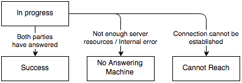
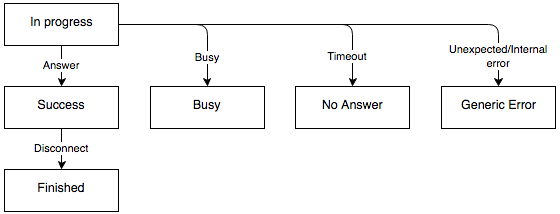
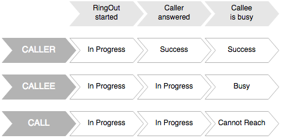

# RingOut

The RingOut option enables the users to make a call from any other outside number (not RingCentral number) by means of the RingCentral account, when it is not convenient for them to use the RingCentral number. This feature is available for softphone, web service and mobile applications.

The user specifies a certain number under the forwarding number list, starts RingOut and enters the required called number. RingCentral makes a call to the specified forwarding number and connects the user with the called number.

The API treats a two-legged RingOut call as a resource that can be created, retrieved, or deleted via the `POST`, `GET` and `DELETE` methods correspondingly.

## Making a Call

The two-legged RingOut call can be created via the following request:

```
POST /restapi/v1.0/account/~/extension/~/ringout
Content-Type: application/json
Authorization: Bearer <access-token> 

{
    "from": {"phoneNumber": "13443334444"}, /* from parameter is optional if there is a default number in user's forwarding numbers */ 
    "to": {"phoneNumber": "13453443434"}, /* to parameter is required */ 
    "playPrompt": true /* optional field */
}
```
 
Where:

-   **from**

    Refers to the number of the calling party. Required field only if there is no default number in the user's forwarding number list. The phoneNumber attribute should comply with the E.164 standard. As a result of validation of the phoneNumber attribute the server may return the error code: 400 Bad Request - phoneNumber specified in the field is empty or invalid.

-   **to**

    Refers to the called party number. Required field. If this field is missing from the request, the 400 Bad Request error is returned. The phoneNumber attribute should comply with the E.164 standard. As a result of validation of the phoneNumber attribute the server may return the error code: 400 Bad Request - phoneNumber specified in the field is empty or invalid.

-   **playPrompt**

    The audio prompt that the calling party hears when the call is connected. Optional field. It corresponds to the setting in the RingCentral application "Prompt me to dial 1 before connecting" (When selected, the system will ask you to press "1" on your phone's key pad before connecting to the destination number).

The response can be as follows:

```
200 OK
Content-Type: application/json 
 
{
    "id": 234343434, 
    "uri": "/restapi/v1.0/account/~/extension/~/ringout/234343434", 
    "status": {  
        "callStatus": "Success",  
        "callerStatus": "Success",  
        "calleeStatus": "Success"   
    }
}
```

Where:

-   **callStatus** can take the following values:

    | Value              | Description                                                               |
    | ------------------ | ------------------------------------------------------------------------- |
    | `InProgress`         | Connection is being established                                           |
    | `Success`            | Both legs connected (Answered)                                            |
    | `CannotReach`        | Failure state (one or both legs are in invalid state for call connection) |
    | `NoAnsweringMachine` | Internal server failure                                                   |

-   **callerStatus**, **calleeStatus** can take the following values:

    | Value                 | Description                                                                                    |
    | --------------------- | ---------------------------------------------------------------------------------------------- |
    | `InProgress`            | Connection to the target leg is being established                                              |
    | `Busy`                  | Target device is busy                                                                          |
    | `NoAnswer`              | The call has been dropped because of timeout                                                  |
    | `Rejected`              | <ul><li>RingOut command was canceled by user *or*</li><li>RingOut initiated, 1st leg answered, 2nd is ringing, user drops call on the 1st leg - 2nd leg gets 'Rejected'</li></ul> |
    | `Success`               | Call party has answered the call                                                               |
    | `Finished`              | The call was terminated (In Progress > Success > Finished)                                |
    | `GenericError`          | <ul><li>Error code received from PSTN *or*</li><li>Internal server error</li></ul>             |
    | `InternationalDisabled` | <ul><li>International calling disabled (Call to International number) *or*</li><li>Domestic calling disabled (Call with local Country code) *or*</li><li>Internal calling disabled (Call within one account)</li></ul>|
    | `NoSessionFound`        | RingOut status was requested for RingOut session which does not exist (e.g was already Closed) |
    | `Invalid`               | RingOut session state is unknown due to internal failure                                       |
	

Call status is generated as a combination of both call legs statuses (caller and callee):


	
Caller or Callee statuses are separately generated for the target call party:
	


## RingOut Flow

See how the statuses are changing during successful call on the flowchart below:


Failed call:



## Polling Call Status

Use polling to get the status of an ongoing outbound call.

    GET/restapi/v1.0/account/~/extension/~/ringout/234343434
   
The response will be as follows:

```
200 OK
Content-Type: application/json

{  
    "id": 234343434, 
    "uri": "/restapi/v1.0/account/~/extension/~/ringout/234343434", 
    "status": {  
        "callStatus": "Success",  
        "callerStatus": "Success",  
        "calleeStatus": "Success"   
    }
}
```

## Call Control

The RingCentral Connect Platform does not currently support control of outbound calls. However, you can cancel ringout call while callee party status is `InProgress`. To do that make a `DELETE` request to ringout URI.

```
DELETE /restapi/v1.0/account/~/extension/~/ringout/234343434  

204 No Content  
```

# URI Scheme

In addition to making calls via the RingOut API, if the user has the RingCentral for Desktop softphone installed, it is possible to use a URI scheme to initiate a dial out from the application.

RingCentral supports both a custom `rcmobile` URI scheme will resolve the issue of competing applications using the same URI scheme and a standard `tel` URI scheme which is more common but subject to competing uses.

## RingCentral URI Scheme

The RingCentral `rcmobile` URI Scheme is specific to RingCentral and thus has a higher probability of working as intended.

```html
<!-- HTML URI Scheme -->
<!-- See below for Google Chrome usage -->
<a href="rcmobile://call?number=16501112222">1-650-111-2222</a>
```

## Standard URI Scheme

The standard `tel` URI Scheme is also supported but since multiple applications can use this URI scheme, there may be competing applications resulting in a less desirable expeirence.

```html
<!-- HTML URI Scheme -->
<!-- See below for Google Chrome usage -->
<a href="tel:1-650-111-2222">1-650-111-2222</a>
<a href="tel:16501112222">1-650-111-2222</a>
```

## Google Chrome Note

Many browsers will support the native `rcmobile` and `tel` URI Schemes via a standard URL `href` described above, however, Google Chrome requires special handling using JavaScript. This is described in more detail [on Stack Overflow](http://stackoverflow.com/questions/2330545/is-it-possible-to-open-custom-url-scheme-with-google-chrome).

```javascript
// Use the following for Google Chrome only
var w = (window.parent)?window.parent:window;
w.location.assign('rcmobile://call?number=16501112222');
```
