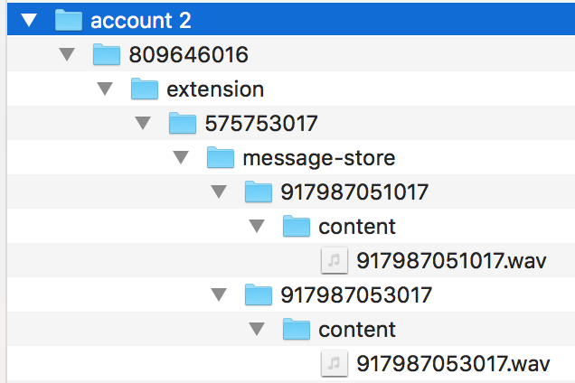

# Message Store Exports

The message store exports API set allows you to archive message store data prior to it being deleted according to the enforcement of RingCentral’s data storage policy and compliance. The data includes message metadata and the actual content (attachments) of instant messaging, fax and voicemail.

RingCentral message store data retention rule is based on the account's setting:

#### Account Data Retention for Non-HIPAA Accounts

| Data | Duration | Count/Size |
|---|---|---|
| Inbox (Fax / Voice Messages) | -- | 200 messages |
| Sent (Fax Messages) | 30 days | -- |
| Outbox (Fax Messages) | n/a | n/a |
| Text Messages (SMS/MMS) | No limit | 5,000 messages per folder, per User (Inbox, Outbox, Sent, Deleted) |
||||

#### Account Data Retention for HIPAA enabled Accounts

| Data | Duration | Count/Size |
|---|---|---|
| Inbox (Fax / Voice Messages) | 30 days | 200 messages |
| Sent (Fax Messages) | 30 days | -- |
| Outbox (Fax Messages) | n/a | n/a |
| Text Messages (SMS/MMS) | No limit | 5,000 messages per folder, per User (Inbox, Outbox, Sent, Deleted) |
||||

!!! Important
    The message store exports APIs run at the account level. This means that only users with the admin role would be able to call these APIs and export the message store of all extensions in the entire account.

## Message Store Exports APIs set

| API | path |
|-----|------|
| Create Message Store Report | `/restapi/v1.0/account/~/message-store-report` |
| Get Message Store Report Task | `/restapi/v1.0/account/~/message-store-report/taskId` |
| Get Message Store Report Archive | `/restapi/v1.0/account/~/message-store-report/taskId/archive` |
| Get Message Store Report Archive Content | `/restapi/v1.0/account/~/message-store-report/taskId/archive/archiveId` |
|||

## How to archive the message store data

There are 4 steps to archive your company message store using the APIs set:

#### 1. Create a message store report task

To create a message store report task:

* Define the period of time for the archive. The period of time is specified by the `dateFrom` and `dateTo` parameters in the body of the POST request.

* Make a POST request to the `/restapi/v1.0/account/~/message-store-report` endpoint.

Required permission(s):  ReadMessages

Upon successful API call completion, the response contains the id (taskId) and the status of the newly created task.

```json hl_lines="3 4", linenums="1"
{
  uri: 'https://platform.devtest.ringcentral.com/restapi/v1.0/account/178009004/message-store-report/178009004-178009004-25464a39df3f4b4390801d80e5e13a01',
  id: '178009004-178009004-25464a39df3f4b4390801d80e5e13a01',
  status: 'Accepted',
  startTime: '2019-07-31T20:01:58Z',
  accountId: '178009004',
  dateFrom: '2019-01-01T00:00:00Z',
  dateTo: '2019-03-31T23:59:59.999Z'
}
```

#### 2. Check the status of a task identified by the taskId

To archive a large message store report (for a long period of time or for an account with a large number of extensions), the report creation process may take several minutes to complete. Therefore, you should check the status of a task to ensure it is marked as “Completed” before you can proceed to get the report.
The status of a task can be any of the following values:

_Accepted - Pending - InProgress - AttemptFailed - Failed - Completed - Cancelled_

To check the status of a task, make a GET request to `/restapi/v1.0/account/~/message-store-report/[taskId]` endpoint. Where the `taskId` is the value of the `id` returned in the previous step.

If the report is ready, the task status is marked as “Completed”.

Upon successful API call completion, the response contains the id (taskId) and the status of the newly created task.
```json hl_lines="3 4", linenums="1"
{
  uri: 'https://platform.devtest.ringcentral.com/restapi/v1.0/account/178009004/message-store-report/178009004-178009004-25464a39df3f4b4390801d80e5e13a01',
  id: '178009004-178009004-25464a39df3f4b4390801d80e5e13a01',
  status: 'Completed',
  startTime: '2019-07-31T20:01:58Z',
  finishTime: '2019-07-31T20:02:11Z',
  accountId: '178009004',
  dateFrom: '2019-01-01T00:00:00Z',
  dateTo: '2019-03-31T23:59:59.999Z' }
```

#### 3. Get the archive file URI.

When a task is created successfully and completed, make a GET request to the `/restapi/v1.0/account/~/message-store-report/[taskId]/archive` endpoint. Where the `taskId` is the value of the `id` returned in the previous step.

Upon successful API call completion, the response is a list of records. Each record contains the URI of the archival file and the size of that file.
```json hl_lines="4 5", linenums="1"
{
  records: [
  {
    size: 14167,
    uri: 'https://platform.devtest.ringcentral.com/restapi/v1.0/account/178009004/message-store-report/178009004-178009004-ed6a473f3aea40819d761242fa6fa331/archive/0'
  },
  {
    size: 2152395,
    uri: 'https://platform.devtest.ringcentral.com/restapi/v1.0/account/178009004/message-store-report/178009004-178009004-ed6a473f3aea40819d761242fa6fa331/archive/1'
  } ]
}
```

#### 4. Download the archive files.

The archival files are .zip compression files. To download the file, append a valid access token to the URI and make an HTTP GET request to the URI.

```http
GET https://platform.devtest.ringcentral.com/restapi/v1.0/account/178009004/message-store-report/[taskId]]/archive/0?access_token=['access_token']
```

The archival report is consisted of two main parts; the archived message metadata and the archived message attachments. If the size of the archived message attachments file is greater than 1GB, the system will generate multiple URIs for message attachment archival files, each file size is max 1GB.

The archived file at the index zero (archive/0) is always a .zip file containing message-store.json files. The files are organized under a folder structure which resembles the message store path to message metadata in RingCentral system:

*/account/[accountId]/extension/[extensionId]/*


The archived file at index one (archive/1) is a .zip file containing attachments of MMS or Fax messages, or voicemail binary file. The files are organized under a folder structure which resembles the message store path to message attachment in RingCentral system:

*/account/[accountId]/extension/[extensionId]/message-store/content/[messageId]*



## Sample code to archive message store data

The following code sample shows how to call the Message Store Export APIs to export the message store data and save it to a local machine.

=== "JavaScript"
	```javascript
	var SDK = require('ringcentral')
	var fs = require('fs')
	var https = require('https');

	var rcsdk = new RC( {server: "server_url", appKey: "client_id", appSecret: "client_secret"} );
	var platform = rcsdk.platform();

	platform.login( {username: "username", password: "password", extension: "extension_number"} )
	    .then(function(resp) {
		create_message_store_report()
	    });
	}

	function create_message_store_report(){
	    var endpoint = "/restapi/v1.0/account/~/message-store-report"
	    var params = {
		dateFrom: "2019-03-01T00:00:00.000Z",
		dateTo: "2019-03-31T23:59:59.999Z"
	      }
	    platform.post(endpoint, params)
	      .then(function(resp){
		  var json = resp.json()
		  get_message_store_report_task(json.id)
	      })
	      .catch(function(e){
		  console.log(e)
	      })
	}

	function get_message_store_report_task(taskId){
	    console.log("check task creation status ...")
	    var endpoint = "/restapi/v1.0/account/~/message-store-report/" + taskId
	    platform.get(endpoint)
	      .then(function(resp){
		  var json = resp.json()
		  if (json.status == "Completed"){
		      get_message_store_report_archive(json.id)
		  }else {
		      setTimeout(function(){
			get_message_store_report_task(taskId)
		      }, 5000);
		  }
	      })
	      .catch(function(e){
		  console.log(e)
	      })
	}

	function get_message_store_report_archive(taskId){
	    console.log("getting report uri ...")
	    var endpoint = "/restapi/v1.0/account/~/message-store-report/"+ taskId +"/archive"
	    platform.get(endpoint)
	      .then(function(resp){
		  var json = resp.json()
		  var date = new Date()
		  for (var i=0; i< json.records.length; i++){
		      var fileName = "message_store_content_" + date.toISOString() + "_" + i + ".zip"
		      get_message_store_report_archive_content(json.records[i].uri, fileName)
		  }
	      })
	      .catch(function(e){
		  console.log(e)
	      })
	}

	function get_message_store_report_archive_content(contentUri, fileName){
	    var uri = platform.createUrl(contentUri, {addToken: true});
	    download(uri, fileName, function(){
		console.log("Save report zip file to the local machine.")
	    })
	}

	const download = function(uri, dest, cb) {
	    var file = fs.createWriteStream(dest);
	    var request = https.get(uri, function(response) {
		response.pipe(file);
		file.on('finish', function() {
		    file.close(cb);
		});
	    });
	}
	```

=== "Python"
	```python
	from ringcentral import SDK

	sdk = SDK( "client_id", "client_secret", "server_url" )
	platform = sdk.platform()
	platform.login( "username", "extension", "password" )

	def create_message_store_report() :
	    endpoint = "/restapi/v1.0/account/~/message-store-report"
	    params = {
		"dateFrom": "2019-01-01T00:00:00.000Z",
		"dateTo": "2019-03-31T23:59:59.999Z"
	    }
	    response = platform.post(endpoint, params)
	    json = response.json()
	    get_message_store_report_task(json.id)

	def get_message_store_report_task(taskId):
	    print("check task creation status ...")
	    endpoint = "/restapi/v1.0/account/~/message-store-report/" + taskId
	    response = platform.get(endpoint)
	    json = response.json()
	    if json.status == "Completed":
			get_message_store_report_archive(taskId)
	    else:
			time.sleep(2)
			get_message_store_report_task(taskId)

	def get_message_store_report_archive(taskId):
	    print("getting report uri ...")
	    endpoint = "/restapi/v1.0/account/~/message-store-report/"+ taskId +"/archive"
	    response = platform.get(endpoint)
	    jsonObj = response.json()
	    length = len(jsonObj.records)
	    dateLog = datetime.datetime.today().strftime("%Y_%m_%d_%H_%M")
	    for i in range(length):
			fileName = "message_store_content_" + dateLog + "_" + str(i) + ".zip"
			get_message_store_report_archive_content(jsonObj.records[i].uri, fileName)

	def get_message_store_report_archive_content(contentUri, zipFile):
	    print("Save report zip file to the local machine.")
	    uri = platform.create_url(contentUri, False, None, True);
	    print (uri)
	    fileHandler = urllib2.urlopen(uri)
	    with open(zipFile, 'wb') as output:
			output.write(fileHandler.read())


	create_message_store_report()
	```

=== "PHP"
	```php
	<?php
	require('vendor/autoload.php');

	$rcsdk = new RingCentral\SDK\SDK( "client_id", "client_secret", "server_url" );

	$platform = $rcsdk->platform();
	$platform->login( "username", "extension_number", "password" );

	create_message_store_report();

	function create_message_store_report(){
	    global $platform;
	    echo ("create report ...\n");
	    $endpoint = "/account/~/message-store-report";
	    try {
		$response = $platform->post($endpoint,
		    array(
			'dateFrom' => "2019-03-01T00:00:00.000Z",
			'dateTo' => "2019-03-31T23:59:59.999Z",
		    ));
		$json = $response->json();
		get_message_store_report_task($json->id);
	    }catch(\RingCentral\SDK\Http\ApiException $e) {
		echo($e);
	    }
	}

	function get_message_store_report_task($taskId){
	    global $platform;
	    echo ("check task creation status ...\n");
	    $endpoint = "/account/~/message-store-report/" . $taskId;
	    try {
		$response = $platform->get($endpoint);
		$json = $response->json();
		if ($json->status == "Completed")
		    get_message_store_report_archive($json->id);
		else if ($json->status == "Accepted" || $json->status == "InProgress"){
		    sleep(2);
		    get_message_store_report_task($taskId);
		}else
		  echo ($json->status);
	    }catch(\RingCentral\SDK\Http\ApiException $e) {
		echo($e);
	    }
	}

	function get_message_store_report_archive($taskId){
	    global $platform;
	    echo ("getting report uri ...\n");
	    $endpoint = "/account/~/message-store-report/" . $taskId . "/archive";
	    try {
		$response = $platform->get($endpoint);
		$json = $response->json();
		for ($i=0; $i < count($json->records); $i++){
		    $fileName = "message_store_content_" . date("Y_m_d_H_i", time()) . "_" . $i . ".zip";
		    get_message_store_report_archive_content($json->records[$i]->uri, $fileName);
		}
		echo ("Done!\n");
	    }catch(\RingCentral\SDK\Http\ApiException $e) {
		echo($e);
	    }
	}

	function get_message_store_report_archive_content($contentUri, $fileName){
	    global $platform;
	    global $archiveFolder;
	    echo ("Save report zip file to the local machine.\n");
	    $uri = $platform->createUrl($contentUri, array(
		'addServer' => false,
		'addMethod' => 'GET',
		'addToken'  => true
	    ));
	    $dest = $archiveFolder.$fileName;
	    file_put_contents($dest, fopen($uri, 'r'));
	}
	```

=== "C#"
	```c#
	using System;
	using System.Threading.Tasks;
	using RingCentral;

	namespace Export_MessageStore
	{
	    class Program
	    {
		static RestClient rcsdk;
		static void Main(string[] args)
		{
		    rcsdk = new RestClient("client_id", "client_secret", "server_url");
		    await rcsdk.Authorize("username", "extension_number", "password");
		    export_message_store().Wait();
		}
		static private async Task export_message_store()
		{
		    var parameters = new CreateMessageStoreReportRequest();
		    parameters.dateFrom = "2019-01-01T00:00:00.000Z";
		    parameters.dateTo = "2019-03-31T23:59:59.999Z";

		    var response = await rcsdk.Restapi().Account().MessageStoreReport().Post(parameters);
		    var jsonStr = JsonConvert.SerializeObject(response);
		    Console.WriteLine(jsonStr);
		    bool polling = true;
		    while (polling)
		    {
			Console.WriteLine("check task creation status ...");
			Thread.Sleep(5000);
			response = await rcsdk.Restapi().Account().MessageStoreReport(response.id).Get();
			if (response.status != "InProgress")
			{
			    polling = false;
			}
		    }
		    if (response.status == "Completed")
		    {
			var resp = await rcsdk.Restapi().Account().MessageStoreReport(response.id).Archive().List();
			DateTime value = DateTime.Now;
			var dateStr = value.ToString("yyyy-MM-dd-HH_mm");
			for (var i = 0; i < resp.records.Length; i++)
			{
			    var fileName = "message_store_content_" + dateStr + "_" + i + ".zip";
			    var contentUrl = resp.records[i].uri + "?access_token=" + rcsdk.token.access_token;
			    WebClient webClient = new WebClient();
			    webClient.DownloadFile(contentUrl, fileName);
			}
		    }
		}
	    }
	}
	```

=== "Java"
	```java
	import com.ringcentral.*;
	import com.ringcentral.definitions.*;
	import java.io.BufferedInputStream;
	import java.io.FileOutputStream;
	import java.io.IOException;
	import java.net.URL;

	public class Export_MessageStore {
	    static RestClient rcsdk;
	    public static void main(String[] args) {
		var obj = new Export_MessageStore();
		rcsdk = new RestClient("client_id", "client_secret", "server_url");
		try {
		    rcsdk.authorize("username", "extension_number", "password");
		    obj.export_message_store();
		} catch (RestException | IOException e) {
		    e.printStackTrace();
		}
	    }

	    public static void export_message_store() throws RestException, IOException{
		var parameters = new CreateMessageStoreReportRequest();
		parameters.dateFrom = "2019-01-01T00:00:00.000Z";
		parameters.dateTo = "2019-03-31T23:59:59.999Z";

		var response =  rcsdk.restapi().account().messagestorereport().post(parameters);
		var taskId = response.id;
		boolean polling = true;
		while (polling)
		{
		    System.out.println("check task creation status ...");
		    try {
			Thread.sleep(5000);
			response = rcsdk.restapi().account().messagestorereport(taskId).get();
			if (!response.status.equals("InProgress"))
				polling = false;
		    } catch (InterruptedException e) {
				e.printStackTrace();
			}
		}
		if (response.status.equals("Completed")) {
			SimpleDateFormat formatter= new SimpleDateFormat("yyyy-MM-dd-HH_mm");
			Date date = new Date(System.currentTimeMillis());
			var dateStr = formatter.format(date);
		    var resp = rcsdk.restapi().account().messagestorereport(response.id).archive().list();
		    for (var i = 0; i < resp.records.length; i++)
		    {
			var fileName = "./src/test/resources/message_store_content_" + dateStr + "_" + i + ".zip";
			var contentUrl = resp.records[i].uri + "?access_token=" + rcsdk.token.access_token;
			try (BufferedInputStream inputStream = new BufferedInputStream(new URL(contentUrl).openStream());
				FileOutputStream fileOS = new FileOutputStream(fileName)) {
				byte data[] = new byte[1024];
				int byteContent;
				while ((byteContent = inputStream.read(data, 0, 1024)) != -1) {
					fileOS.write(data, 0, byteContent);
				}
			} catch (IOException e) {
			   // handles IO exceptions
			}
		    }
		}
	    }
	}
	```

=== "Ruby"
	```ruby
	require 'ringcentral'
	require "open-uri"

	$rc = RingCentral.new( 'client_id', 'client_secret', 'server_url')
	$rc.authorize( username:  'username', extension: 'extension_number', password:  'password')

	def create_message_store_report()
	    endpoint = "/restapi/v1.0/account/~/message-store-report"
	    response = $rc.post(endpoint, payload: {
		dateFrom: "2019-01-01T00:00:00.000Z",
		dateTo: "2019-03-31T23:59:59.999Z"
	      })
	    puts response.body['id']
	    puts response.body['status']
	    get_message_store_report_task(response.body['id'])
	end

	def get_message_store_report_task(taskId)
	    puts "check task creation status ..."
	    endpoint = "/restapi/v1.0/account/~/message-store-report/" + taskId
	    response = $rc.get(endpoint)
	    if response.body['status'] == "Completed"
		get_message_store_report_archive(taskId)
	    else
		sleep(2)
		get_message_store_report_task(taskId)
	    end
	end

	def get_message_store_report_archive(taskId)
	    puts "getting report uri ..."
	    endpoint = "/restapi/v1.0/account/~/message-store-report/"+ taskId +"/archive"
	    response = $rc.get(endpoint)
	    length = response.body['records'].length
	    dateLog = Time.now.strftime("%Y_%m_%d_%H_%M")
	    for i in (0...length)
		fileName = "message_store_content_" + dateLog + "_" + i.to_s + ".zip"
		get_message_store_report_archive_content(response.body['records'][i]['uri'], fileName)
	    end
	end

	def get_message_store_report_archive_content(contentUri, zipFile)
	    puts "Save report zip file to the local machine."
	    uri = contentUri + "?access_token=" + $rc.token['access_token']
	    open(uri) do |data|
	      File.open(zipFile, "wb") do |file|
		file.write(data.read)
	      end
	    end
	end

	create_message_store_report()
	```

## Relevant APIs for Further Reading

* [Get Message List](https://developers.ringcentral.com/api-reference/Message-Store/listMessages)
* [Get Message Attachment](https://developers.ringcentral.com/api-reference/Message-Store/readMessageContent)
* [Delete Message(s)](https://developers.ringcentral.com/api-reference/Message-Store/deleteMessage)
* [Sync Messages](https://developers.ringcentral.com/api-reference/Message-Store/syncMessages)
