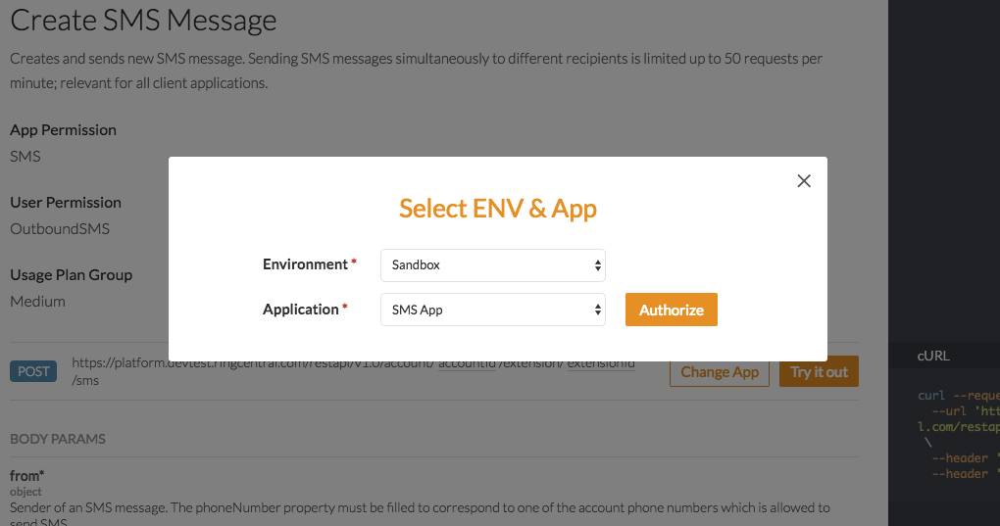
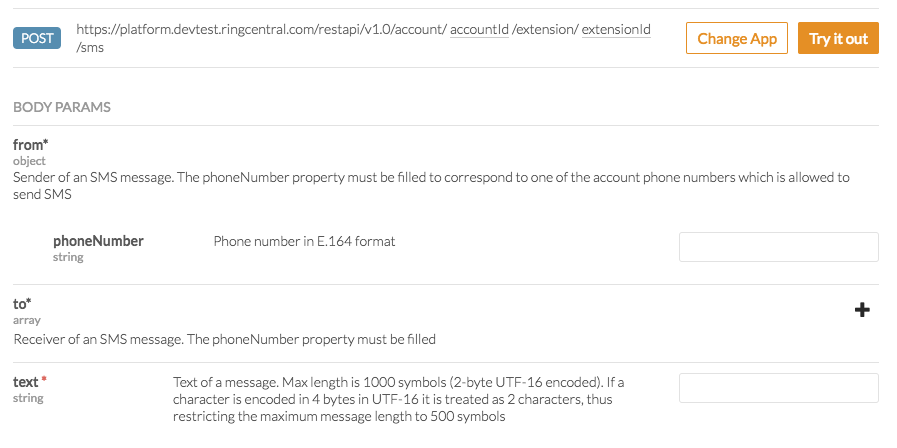

no_breadcrumb:true

# RingCentral Quick Start

Welcome to the RingCentral Platform. RingCentral is the leading unified communications platform. From one system developers can integrate with, or build products around all the ways people communicate today:

* [SMS and MMS](../sms)
* [Voice](../voice)
* [Fax](../fax)
* [Chat/Text Messaging](../glip)
* Online Meetings

To introduce you to the platform we are going to walk you through building one of the most common use cases on our platform: sending an SMS or text message to phone. Let's get started.

## Create an App

The first thing we need to do is create an app in the RingCentral Developer Portal. If you do not yet have RingCentral account, please [create one](https://developer.ringcentral.com/login.html#/). Once you are logged in, follow these instructions:

1. Go to Console/Apps and click 'Create App' button.
2. Give your app a name and description, then click Next.
3. On the second page of the create app wizard enter the following:
    * Select 'Private' for Application Type.
    * Select 'Server-only (No UI)' for Platform Type.
4. On the third page of the create app wizard, select the following permissions:
    * SMS
    * Webhook Subscriptions
5. Leave "OAuth Redirect URI" blank for now. We will come back and edit that later. 

When you are done, you will be taken to the app's dashboard. Make note of the Client ID and Client Secret. We will be using those momentarily.

## Send an SMS

Select your preferred language below:

<ul class="nav nav-pills mb-3" id="pills-tab" role="tablist">
  <li class="nav-item">
    <a class="nav-link active" id="pills-node-tab" data-toggle="pill" href="#pills-node" role="tab" aria-controls="pills-node" aria-selected="true">Node</a>
  </li>
  <li class="nav-item">
    <a class="nav-link" id="pills-php-tab" data-toggle="pill" href="#pills-php" role="tab" aria-controls="pills-php" aria-selected="false">PHP</a>
  </li>
  <!--
  <li class="nav-item">
    <a class="nav-link" id="pills-python-tab" data-toggle="pill" href="#pills-python" role="tab" aria-controls="pills-python" aria-selected="false">Python</a>
  </li>
  -->
  <li class="nav-item">
    <a class="nav-link" id="pills-explorer-tab" data-toggle="pill" href="#pills-explorer" role="tab" aria-controls="pills-explorer" aria-selected="false">API Explorer</a>
  </li>
</ul>

  

<h3>Create Project Directory</h3>

Let's get started by created a directory to hold your project files.

<pre><code>
$ mkdir ringcentral-sms-project
$ cd ringcentral-sms-project
</code></pre>

<h3>Create .env</h3>

Now, create a file called <tt>.env</tt> using the sample text below. Enter in your app's client ID and secret, and the other values called for.

<pre><code>
RINGCENTRAL_CLIENTID=
RINGCENTRAL_CLIENTSECRET=
RINGCENTRAL_SERVER=https://platform.devtest.ringcentral.com

RINGCENTRAL_USERNAME=&lt;YOUR ACCOUNT PHONE NUMBER>
RINGCENTRAL_PASSWORD=&lt;YOUR ACCOUNT PASSWORD>
RINGCENTRAL_EXTENSION=&lt;YOUR EXTENSION, PROBABLY "101">
</code></pre>

<h3>Create package.json</h3>

Create another file called <tt>package.json</tt> using the text below.

<pre><code>
{
   "name": "ringcentral-sms-project",
   "version": "0.1.0",
   "description": "A test project to evaluate using RingCentral.",
   "main": "index.js",
   "dependencies": {
      "dotenv": "^6.1.0",
      "express": "^4.16.4",
      "http": "0.0.0",
      "ringcentral-js-concise": "^0.7.1"
   },
   "scripts": {
      "test": "echo \"Error: no test specified\" && exit 1"
   },
   "engines": {
      "node": "*"
   }
}
</code></pre>

<h3>Create and Edit index.js</h3>

Create a file called <tt>index.js</tt>. Be sure to edit the first line with the recipient's phone number.

<pre><code>
var RECIPIENT_PHONE = '&lt;ENTER YOUR PHONE NUMBER HERE>'
var RingCentral = require('ringcentral-js-concise').default
var dotenv = require('dotenv')
dotenv.config();

const client = new RingCentral(process.env.RINGCENTRAL_CLIENTID,
                               process.env.RINGCENTRAL_CLIENTSECRET,
                               process.env.RINGCENTRAL_SERVER )
client.authorize({
    username:  process.env.RINGCENTRAL_USERNAME,
    extension: process.env.RINGCENTRAL_EXTENSION,
    password:  process.env.RINGCENTRAL_PASSWORD
}).then( function() {
    const r = client.post('/restapi/v1.0/account/~/extension/~/sms', {
        from: { phoneNumber: process.env.RINGCENTRAL_USERNAME },
        to:  [{ phoneNumber: RECIPIENT_PHONE }],
        text: 'Hello World!'
    });
}).catch( function( error ) {
    console.log("ERROR: " + error)
});
</code></pre>

<h3>Run Your Code</h3>

You are almost done. Now have <tt>npm</tt> install your dependencies, and then run your script.

<pre><code>
$ npm install
$ npm index.js
</code></pre>

  

  

<h3>Create Project Directory</h3>

Let's get started by created a directory to hold your project files.

<pre><code>
$ mkdir ringcentral-sms-project
$ cd ringcentral-sms-project
</code></pre>

<h3>Install Composer</h3>

<pre><code>
$ curl -sS https://getcomposer.org/installer | php
</code></pre>

<h3>Create composer.json</h3>

Create another file called <tt>composer.json</tt> using the text below.

<pre><code>
{
    "minimum-stability": "dev"
}
</code></pre>

<h3>Install Prereqs</h3>

<pre><code>
$ php composer.phar require ringcentral/ringcentral-php
$ php composer.phar require vlucas/phpdotenv
</code></pre>

<h3>Create .env</h3>

Now, create a file called <tt>.env</tt> using the sample text below. Enter in your app's client ID and secret, and the other values called for.

<pre><code>
RINGCENTRAL_CLIENTID=
RINGCENTRAL_CLIENTSECRET=
RINGCENTRAL_SERVER=https://platform.devtest.ringcentral.com

RINGCENTRAL_USERNAME=&lt;YOUR ACCOUNT PHONE NUMBER>
RINGCENTRAL_PASSWORD=&lt;YOUR ACCOUNT PASSWORD>
RINGCENTRAL_EXTENSION=&lt;YOUR EXTENSION, PROBABLY "101">
</code></pre>

<h3>Create and Edit index.php</h3>

Create a file called <tt>index.php</tt>. Be sure to edit the first line with the recipient's phone number.

<pre><code>
&lt;?php
$RECIPIENT = "&lt;ENTER RECIPIENT PHONE NUMBER>";

require_once __DIR__ . '/vendor/autoload.php';
$dotenv = new Dotenv\Dotenv(__DIR__);
$dotenv->load();

use RingCentral\SDK\SDK;
$rcsdk = new SDK( getenv('RINGCENTRAL_CLIENTID'),
                  getenv('RINGCENTRAL_CLIENTSECRET'),
                  getenv('RINGCENTRAL_SERVER'),
                  'Demo', '1.0.0');
$platform = $rcsdk->platform();
// Authorize
$platform->login( getenv('RINGCENTRAL_USERNAME'),
                  getenv('RINGCENTRAL_EXTENSION'),
                  getenv('RINGCENTRAL_PASSWORD'),
                  true );
// Send SMS
$response = $platform
  ->post('/account/~/extension/~/sms', array(
            'from' => array('phoneNumber' => getenv('RINGCENTRAL_USERNAME')),
            'to'   => array(
                array('phoneNumber' => $RECIPIENT),
            ),
            'text' => 'Hello World!',
  ));
print 'Sent SMS ' . $response->json()->uri . PHP_EOL;
?>
</code></pre>

<h3>Run Your App</h3>

You are almost done. Now, run your script.

<pre><code>
$ php index.php
</code></pre>

  

  

  

  

The RingCentral API Explorer serves as a reference and test bench for all of RingCentral's API. This allows you to make calls with zero code. Let's get started.

<h3>Access the RingCentral API Explorer</h3>

Visit the [SMS section of the API Explorer](https://developer.ringcentral.com/api-reference#SMS-and-MMS-sendSMS). You should see this:

<h3>Sign-in and Select App</h3>

Click the "Sign-in to try it out" button, and login to your developer account. When you are done, click the "Change App" button.

Then select the app your created in the first step.

<h3>Set Call Parameters</h3>

Now, set the API call parameters for the "from," "to" and "text" fields. For the "from" field use your account's phone number, and for the "to" field use your personal mobile phone number.

<h3>Try it out</h3>

Click the "Try it out" button to send yourself an SMS. If it works, try doing the same thing using one of our code samples.

  

## Publish Your App

Congradulations on creating your first RingCentral application. The last step is to publish your application. We recommend [going through this process](../basics/publish) for your first application so you can understand the steps to take in the future, but also to come to appreciate the care taken by RingCentral to ensure that only high-quality apps are allowed into our production environment.
