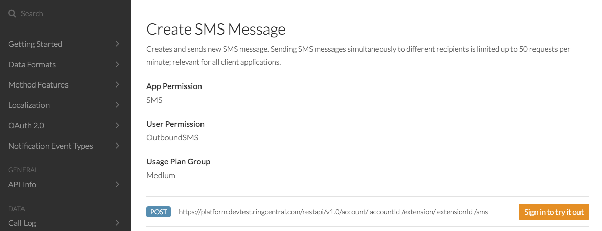

no_breadcrumb:true

# SMS API Explorer Quick Start

Welcome to the RingCentral Platform. RingCentral is the leading unified communications platform. From one system developers can integrate with, or build products around all the ways people communicate today: SMS, voice, fax, chat and meetings. 

In this Quick Start, we are going to help you send your first SMS on the platform in just a few minutes. Let's get started.

## Create an App

The first thing we need to do is create an app in the RingCentral Developer Portal. This can be done quickly by clicking the "Create SMS App" button below. Just click the button, enter a name and description if you choose, and click the "Create" button. If you do not yet have a RingCentral account, you will be prompted to create one.

<a target="_new" href="https://developer.ringcentral.com/new-app?name=SMS+Quick+Start+App&desc=A+simple+app+to+demo+sending+an+SMS+on+RingCentral&public=false&type=ServerOther&carriers=7710,7310,3420&permissions=SMS,ReadMessages&redirectUri=" class="btn btn-primary">Create SMS App</a>
<a class="btn-link btn-collapse" data-toggle="collapse" href="#create-app-instructions" role="button" aria-expanded="false" aria-controls="create-app-instructions">Show detailed instructions</a>

<ol>
<li><a href="https://developer.ringcentral.com/login.html#/">Login or create an account</a> if you have not done so already.</li>
<li>Go to Console/Apps and click 'Create App' button.</li>
<li>Give your app a name and description, then click Next.</li>
<li>On the second page of the create app wizard enter the following:
  <ul>
  <li>Select 'Private' for Application Type.</li>
  <li>Select 'Server-only (No UI)' for Platform Type.</li>
  </ul>
  </li>
<li>On the third page of the create app wizard, select the following permissions:
  <ul>
    <li>SMS</li>
    <li>Webhook Subscriptions</li>
  </ul>
  </li>
<li>Leave "OAuth Redirect URI" blank for now. We will come back and edit that later.</li>
</ol>

When you are done, you will be taken to the app's dashboard. Make note of the Client ID and Client Secret. We will be using those momentarily.

## Send an SMS

The RingCentral API Explorer serves as a reference and test bench for all of RingCentral's API. This allows you to make calls with zero code. Let's get started.

### Access the RingCentral API Explorer

Visit the [SMS section of the API Explorer](https://developer.ringcentral.com/api-reference#SMS-and-MMS-sendSMS). You should see this:

### Sign-in and Select App

Click the "Sign-in to try it out" button, and login to your developer account. When you are done, click the "Change App" button.

Then select the app your created in the first step.

### Set Call Parameters

Now, set the API call parameters for the "from," "to" and "text" fields. For the "from" field use your account's phone number, and for the "to" field use your personal mobile phone number.

### Try it out

Click the "Try it out" button to send yourself an SMS. If it works, try doing the same thing using one of our code samples.

## Publish Your App

Congradulations on creating your first RingCentral application. The last step is to publish your application. We recommend [going through this process](../basics/publish) for your first application so you can understand the steps to take in the future, but also to come to appreciate the care taken by RingCentral to ensure that only high-quality apps are allowed into our production environment.
