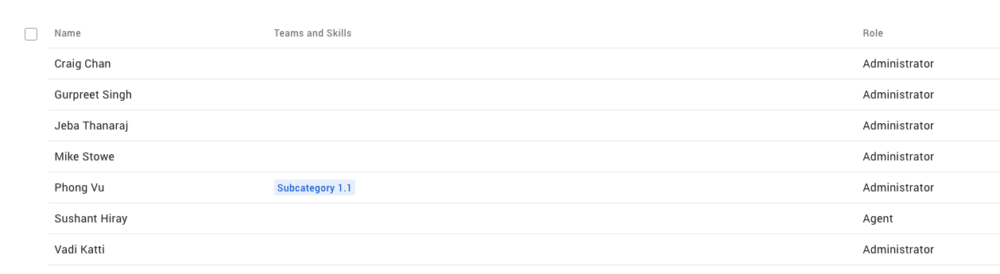
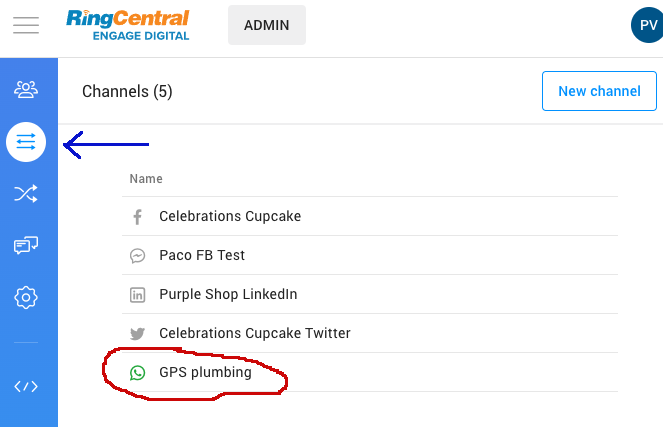
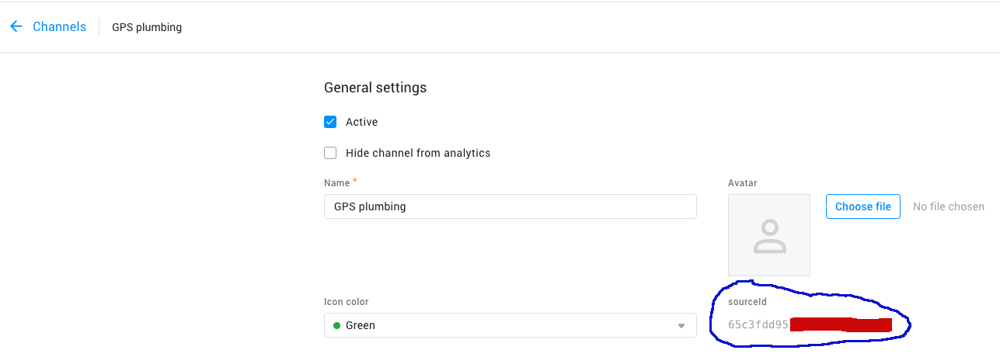
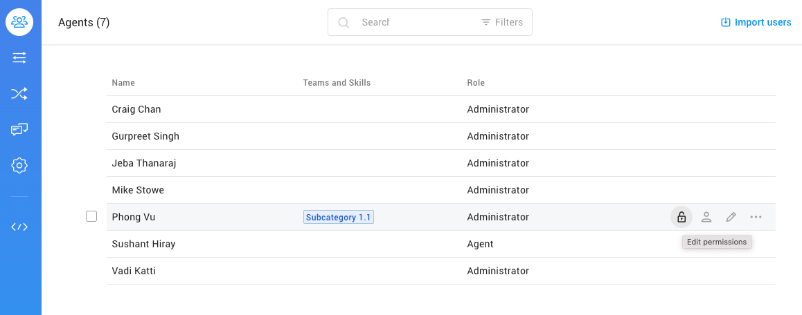
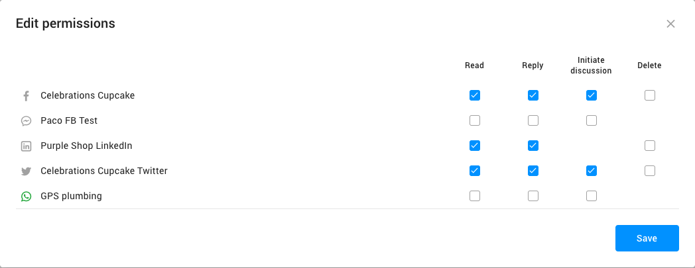
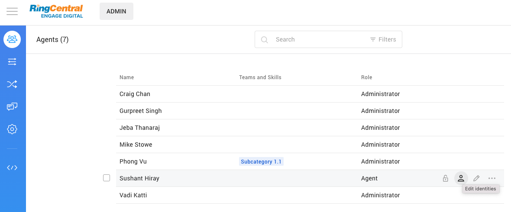
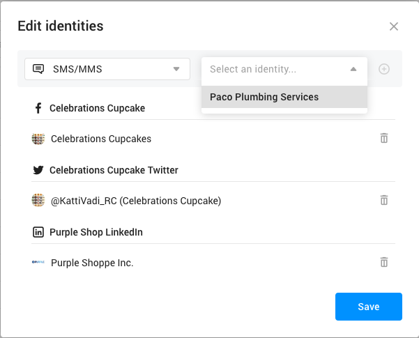

# Introduction to the RingCentral Social Messaging APIs

## Overview

RingCentral Social Messaging is an integrated social networking platform that consolidates various popular social media sites such as WhatsApp, Facebook, LinkedIn, and others into a centralized social messaging hub. Its primary aim is to offer RingCentral business customers an outstanding social media marketing solution.

Any RingCentral customer with RingCX (formerly known as Engage Digital) and MVP accounts will gain access to the Social Messaging platform through APIs. This enables RingCentral customers to either develop stand-alone applications or seamlessly integrate the social messaging service into their existing products, thereby enhancing user experience and productivity.

The Social Messaging API set is a part of the RingCentral API platform. Thus, building a social messaging application that would invoke the APIs will require an application registration on the RingCentral developer portal. If you're unfamiliar with RingCentral application development, please consult [the developer guide](https://developers.ringcentral.com/guide/applications) for assistance and guidance. To access the social messaging features via APIs, the application must be assigned the 'social-messaging' app scope, along with any other app scopes required to access other the MVP platform features.

With access to the Social Messaging APIs, developers can:

* Build an application that allows an MVP user (a user extension with a RingCentral MVP license is required) to send and receive messages via a single or multiple connected channels.
* Build an application that allows multiple MVP users to share an inbox (shared inbox) that all can send and receive messages over social channels using the same phone number.
* Build an application that reads the messaging contents from connected channels for compliance or archiving purpose or even for content analytics.

!!! Note
    During the Beta stage, access right to the Social Messaging APIs will be granted based on customer's request by signing the signup form below. After submitting the request, you will be contacted by RingCentral and we will help set up your account and provide further instructions for the Beta access.

    [Social Messaging Developer Signup Form &raquo;](https://docs.google.com/forms/d/e/1FAIpQLSdj2nC4VA2ppfdYJA4-BNAsgnElrU2eiNdhXeieZmvERpjPXA/viewform){class="btn btn-primary"}

{! mdx_includes/social-messaging-beta-notice.md !}

## Accounts settings

In order to access the RingCentral Social Messaging APIs, a RingCentral customer needs to have both RingCentral RingCX Digital and MVP accounts.

To start using the Social Messaging platform, a customer needs to login their RingCX admin portal to setup agents (users) and social media channels.

## Agents and Roles

An agent is a user extension (with an MVP license) under the RingCentral MVP account, who is setup to access the RingCX Digital account. Each agent is designated with a specific role, delineating the operational scopes they are authorized to perform within the RingCX account.



<b><em>Agents and roles</em></b>

## Channels

A channel, also known as a source, serves as the connection between a RingCentral Social Messaging platform and a public social media platform like WhatsApp, Viber, Facebook, and others. Each channel establishes a pipeline linking your RingCentral Messaging account to your business's social media account on a public platform. This enables your agents to engage in communication with your customers or audience members who are connected to your business on that particular social media platform.

RingCentral Social Messaging platform currently allows you to create channels connecting to the following public social media platforms:

* WhatsApp
* Apple Messages for Business (AMB)
* Google Messages for Business
* Facebook
* Twitter
* Instagram
* LinkedIn
* YouTube
* Google Reviews
* Viber

To create a channel from your RingCX account, follow the [instructions](https://support.ringcentral.com/engagedigital/admin/configure-entry-points.html) on this page to setup and configure the channel.



<em>An example of a connected WhatsApp channel</em>

Under the RingCentral Social Messaging platform, a channel is identified by a unique `sourceId`. The source Id can be specified in an API to operate on that particular channel. For example when listing contents from a particular channel, the `sourceId` of that channel can be set in the API query parameters.

Currently, there is no API to list all connected channels under a RingCX account. In order to identify a channel, developers will need to login the RingCX admin portal, open a channel and grab the `sourceId` as shown below.



## Agents Permissions Settings

An agent must be assigned with full or partial permissions to access content messages on a channel.

| Permission   | Scope |
| -------------- | ------ |
| `Read` | The agent can read content messages from this channel. |
| `Reply` | The agent can reply to a content message in this channel. |
| `Initiate discussion` | The agent can start a discussion (send a new message) to this channel. |
| `Delete` | The agent can delete a content message in this channel. |

To assign the permissions to an agent, select the Agents view and on the agents list, move the mouse over an agent item and click on the "lock" icon as shown in the example below.





<em>An example of agent permissions setting</em>

## Identities

There are 2 types of identity, customer (your contact) identity and agent identity.

A customer identity is a unique user (your contact) from a connected channel who can send and receive messages via that social media channel. A customer identity will be created and listed in your [account identities list](#identity-api) when the user sends a message to that connected channel.

An agent identity is a representative of a group of agents who are assigned to handle content messages in a channel. An agent can be added to or removed from an agent identity using the RingCX admin portal as shown below:





<em>An example of editing an agent identity</em>

Each agent has its own `userId`, which is the RingCentral extension id ported from the RingCentral RingEX account. An agent identity contains a list of user Ids inside the `userIds` array.

## Content

Content refers to message details including body text, attachments, and message metadata exchanged on connected channels. These messages can take various forms, ranging from simple text messages to rich structured messages like carousels or rich links, and may include attachments in the form of text or binary files.

It's important to note that the metadata and message limitations of content from one channel may differ from those of other channels, highlighting the need for flexibility and adaptation when working across multiple social media platforms.

### Content API

The Contents APIs facilitate the reading of content from connected channels and the sending of messages out through those channels.

| API Endpoint      | Method   | Description                                        |
| -------------- | ------ | ------------------------------------------------------- |
| [`/cx/social-messaging/v1/contents`](#list-content-endpoint) | GET | List all contents from connected channels. |
| [`/cx/social-messaging/v1/contents`](#create-content-endpoint)   | POST | Post a content message to a connected channel.  |
| [`/cx/social-messaging/v1/contents/[contentId]`](#get-content-endpoint) | GET | Read a single content message identified by a content id. |

For receiving content messages instantly, see the [Content Notifications](#content-notifications) section.

#### List Content Endpoint

This API reads contents ordered by creation time (default to descending). If there are no filter parameters specified in the API call, the API will return a list of contents from connected channels in which the authenticated agent is assigned with the `Read` permissions.

The response is a flat list of contents (not nested). This means that an initiated message and the replied messages are listed as separated messages. To chain those messages for creating a conversation, you must rely on the content's `threadId` values. If you want to precisely match an agent reply message to a customer message, you must match the content message `id` of a customer message and the `inReplyToContentId` of an agent message.

For a busy RingCX account with multiple connected channels where there are thousands of messages in each channel. It's recommended to use one or more filters in the table below to optimize response and list only the contents of interest.

You can set the max number of content messages per page to limit the size of the response and use the next page token (if available) to read more content messages.

Essential Request Query Parameters

| Parameter      | Type   | Description                                             |
| -------------- | ------ | ------------------------------------------------------- |
| `authorIdentityIds`   | List[String] | Return only content messages sent by the specified author identity Ids.  |
| `authorIdentityGroupIds` | List[String] | Return only content messages belong to the specified author identity group Ids. |
| `sourceIds` | List[String] | Return only content messages from specified channel Ids. |
| `threadIds` | List[String] | Return only content messages with the same specified thread Ids.  |
| `texts`    | List[String] | Return content messages that contain the specified texts. |
| `status`   | List[String] | Return content messages with specified message status. Permitted values: `New`, `Assigned`, `Replied`, `UserReply`, `UserInitiated`, `Ignored`  |
| `orderBy` | Enum  | Return content messages in the descending or ascending order of their creation time. Permitted values: `-creationTime` or `+creationTime` |
| `perPage`    | Number | Return the maximum number of content messages per API call. Max value is 1000 |

#### Example code to list all contents

Try out the [Social Messaging Quick Start Guide](quick-start.md)

#### Create Content Endpoint

This API can be used for posting a new message on a connected channel, or for replying to an inbound message from a customer.

##### Posting a new content

To post a new message on a connected channel, the authenticated agent must have the `Initiate discussion` permission in that channel. The requirements and the body parameters of a new message differs from channel to channel.

* Posting a new message to a customer in your WhatsApp channel requires an approved message template predefined in your WhatsApp account.
* Social media channels like Instagram and FaceBook Messenger may not support posting new a message on the channels.
* Some sources (usually public account) like Twitter or Facebook page allows you to publish content without targeting specific individuals.
* Some sources (usually non public media) require specific targeting (phone number for SMS, email address for email, customer_id ...) to be able to create a content. This is source specific and detailed under the generic parameters.

##### Reply to a customer message

To reply to an inbound message (a message sent from a customer), the authenticated agent must have the `Reply` permission in that channel.

!!! Note
    Replying to a customer's message is not possible if the channel/conversation is read only.

Replying to an inbound message requires the `inReplyToContentId` body parameter to explicitly set with the `id` of that inbound message.

There is no direction metadata to identify a customer message or an agent message. But you can reply on the content message status to identify the direction as shown below:

| Content status      | Direction   | Description   |
| -------------- | ------ | ------------------------------------------------------- |
| `New`, `Replied`, `Ignored`   | Inbound | This content message is sent from a customer.  |
| `UserInitiated`, `UserReply` , `PendingApproval` | Outbound | This content message is sent from an agent.  |

The created message's author identity id will be automatically assigned with the agent identity id in which the authenticated agent belongs to.


#### Example code to reply to a message

=== "JavaScript"

    ```javascript
    {!> code-samples/social-messaging/code-snippets-headers/header.js [ln:1-14] !}
    {!> code-samples/social-messaging/code-snippets/reply-message.js [ln:10-] !}
    ```

=== "Python"

    ```python
    {!> code-samples/social-messaging/code-snippets/reply-message.py !}
    {!> code-samples/social-messaging/code-snippets-headers/footer.py [ln:1-5] !}
    ```

=== "PHP"

    ```php
    {!> code-samples/social-messaging/code-snippets-headers/header.php [ln:1-9] !}
    {!> code-samples/social-messaging/code-snippets/reply-message.php [ln:2-] !}
    ```

=== "Ruby"

    ```ruby
    {!> code-samples/social-messaging/code-snippets/reply-message.rb !}
    {!> code-samples/social-messaging/code-snippets-headers/footer.rb [ln:1-4] !}
    ```    

#### Content Notifications

The RingCentral API platform supports [Push Notifications Subscription](../notifications/index.md) service through WebHook and WebSockets transport methods. It allows developers to choose a transport method and subscribe for event types to receive notifications when that type of event occurs.

The Social Messaging event notification supports the following event types:

| Type | Description |
| - | - |
|`/cx/social-messaging/v1/contents/Imported`| Get notify when a new content has been imported from a channel (e.g. WhatsApp) to your RingCX Digital inbox.|
|`/cx/social-messaging/v1/contents/Exported`| Get notify when an agent reply content message has been dispatched to a channel (e.g. FaceBook).|
|`/cx/social-messaging/v1/contents/DiscussionInitiated`| Get notify when an agent has posted a new content to a connected channel (e.g. FaceBook).|

!!! Important
    Currently, only the WebHook transport method is supported for Social Messaging event notifications.

### Identities API

The Identity APIs facilitate the reading of customer and agent identities from a RingCX Digital account.

| API Endpoint      | Method   | Description                                        |
| -------------- | ------ | ------------------------------------------------------- |
| `/cx/social-messaging/v1/identities` | GET | List all identities from your RingCX account. |
| `/cx/social-messaging/v1/identities/[identityId]`   | GET | Read an identity info identified by the identity Id.  |

The APIs typically provide essential information about an identity, including the `displayName`, `creationTime`, and `id`. However, additional detailed information such as `emailAddress`, `phoneNumber`, `avatarUri`, and `gender` may not always be available, depending on the social media channel type or relevance.

At present, there isn't specific metadata dedicated to distinguishing between a customer identity and an agent identity. However, an agent identity data object will contain one or more values within the `userIds` list, whereas a customer identity data object will have an empty `userIds` list.

#### Example code to list all identities from an account

=== "JavaScript"

    ```javascript
    {!> code-samples/social-messaging/code-snippets-headers/header.js [ln:1-14] !}
    {!> code-samples/social-messaging/code-snippets/list-identities.js [ln:10-] !}
    ```

=== "Python"

    ```python
    {!> code-samples/social-messaging/code-snippets/list-identities.py !}
    {!> code-samples/social-messaging/code-snippets-headers/footer.py [ln:1-5] !}
    ```

=== "PHP"

    ```php
    {!> code-samples/social-messaging/code-snippets-headers/header.php [ln:1-9] !}
    {!> code-samples/social-messaging/code-snippets/list-identities.php [ln:2-] !}
    ```

=== "Ruby"

    ```ruby
    {!> code-samples/social-messaging/code-snippets/list-identities.rb !}
    {!> code-samples/social-messaging/code-snippets-headers/footer.rb [ln:1-4] !}
    ```

#### Identify content messages senders

The list contents API and the get content API return a list of content messages and a single content message, respectively. Each content message is associated with an `authorIdentityId`, which represents the ID of the sender's identity. To determine the sender's name, you can use the `authorIdentityId` value of the message to call the get identity API to get the identity name.

In the case of an outbound message sent from an agent identity, to identify the agent who posted that message, you can verify the existence of the `creatorId` within the message object. If present, you can use the `creatorId` value (which is an extension ID) to retrieve the agent information using the [Get Extension API](https://developers.ringcentral.com/api-reference/User-Settings/readExtension).
