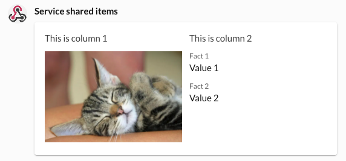
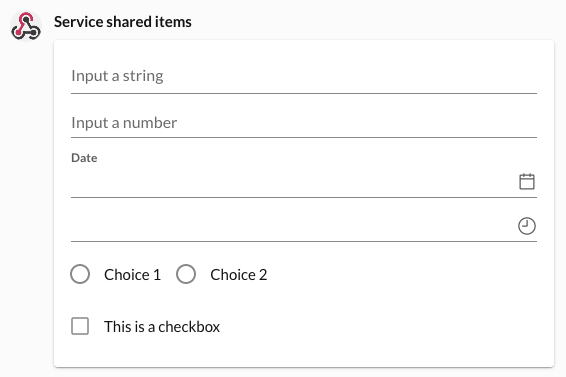
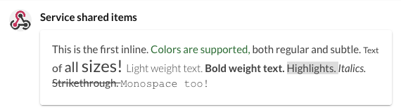
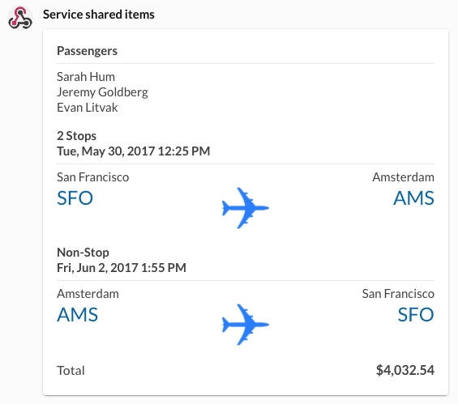
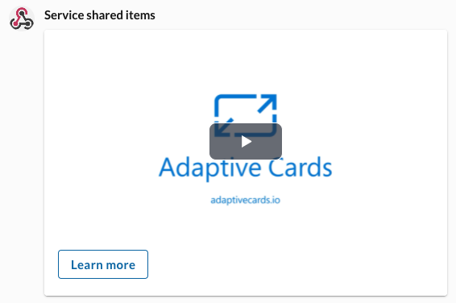
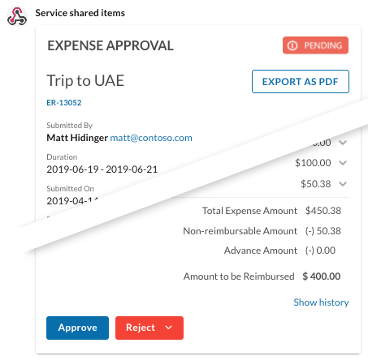

# Adaptive Cards

<h2 class="h4 pb-2 lh-lg">Allow users to interact directly with messages to get more work done without leaving RingCentral team messaging.</h2>

Adaptive Cards allows developers to implement richly formatted and interactive messages in team messaging, including form elements, buttons, and more.

  

    <figure class="figure">
      
      <figcaption class="figure-caption text-center">Multi-column layouts</figcaption>
    </figure>
  

  

    <figure class="figure">
      
      <figcaption class="figure-caption text-center">Input elements and forms</figcaption>
    </figure>
  

  

    <figure class="figure">
      
      <figcaption class="figure-caption text-center">Richly formatted text</figcaption>
    </figure>
  

RingCentral implements the [Adaptive Card framework](https://adaptivecards.io) version 1.3. Originally developed by Microsoft, this open source framework aids developers with the design and development of richly formatted and interactive messages common to team chat and messaging services.

This means that if you have developed integrations for Microsoft Teams, the level of effort associated with adapting your integration for RingCentral MVP is greatly reduced. 

## Use great design tools to design your cards

Among the many benefits of Adaptive Cards, are the robust set of tools made available through the broader Adaptive Card community to help developer design and implement cards for almost any use case. First, there is a [large library](https://adaptivecards.io/samples/) of pre-made adaptive cards from which to choose, including:

  

    <figure class="figure">
      
      <figcaption class="figure-caption text-center">Flight itineraries</figcaption>
    </figure>
  

  

    <figure class="figure">
      
      <figcaption class="figure-caption text-center">Videos and media</figcaption>
    </figure>
  

  

    <figure class="figure">
      
      <figcaption class="figure-caption text-center">The dreaded expense report</figcaption>
    </figure>
  

...with many more to choose from.

And if you cannot find a pre-made template to suit your needs, an [Adaptive Card designer](https://adaptivecards.io/designer/) also exists to help you design a card to your exact specifications. This tool makes it possible for technical and non-technical people alike to create cards with ease, and does not require users to first understand the [Adaptive Card schema](https://adaptivecards.io/explorer/). Finally, using the design tool, you can also preview your cards and its interactive elements. 

* Learn more about [Adaptive card layouts and design](./containers/)

## Build smart and interactive messages

Adaptive Cards can also be embued with behaviors to make them more interactive and intelligent. Create cards with built-in forms. Have forms that react to user input, showing and hiding fields depending upon what is appropriate. Create cards that trigger events and actions like opening a web browser, submitting form contents, revealing other cards. 

* Learn more about [Adaptive card actions and interactive elements](./actions/)

## Use Adaptive Cards in all kinds of applications

Adaptive Cards can be used in any number of different RingCentral applications, including:

* [Bots](./bots/walkthrough)
* [Add-ins](./add-ins/)
* [REST API-based apps](./posting/rest-api/)
