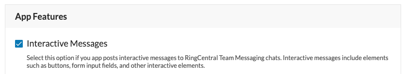

# Troubleshooting Adaptive Cards

## "Attachment does not match any schema"

**Problem**

When posting a card, you receive an error message saying that it "does not match any schema." 

**Sample error**

```json
{
  "status":"error",
  "message":"Your request was accepted, however a post was not generated",
  "error":"Invalid AdaptiveCard payload",
  "validation":[
	"payload.attachments[0] does not match any schema"
  ]
}
```

**Solution**

The most likely explanation is that your adaptive card is not properly formed. It may be syntactically valid, but not semantically valid. Copy and paste your message into the [message designer](https://adaptivecards.io/designer/) and look for validation errors. 

## Outgoing webhook not being sent

**Problem**

Users are clicking the `Action.Submit` button in an adaptive card, but my app is not receiving a webhook notification. 

**Solution**

Check the following:

* Make sure the application posting the message has the "Interactive Messages" feature enabled. Login to the Developer Console, edit the app, and toggle "Interactive Messages." Finally, enter an Outbound Webhook URL. 
   
   
* Make sure you are not posting to a generic incoming webhook URL. If the incoming webhook you are posting to was created by installing the app entitled "Incoming webhook," then interactive messages will not work because RingCentral has no outbound webhook URL to which to deliver notifications. 

