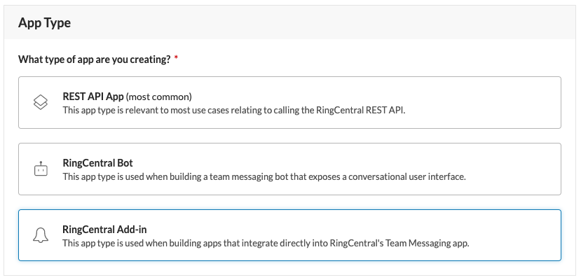
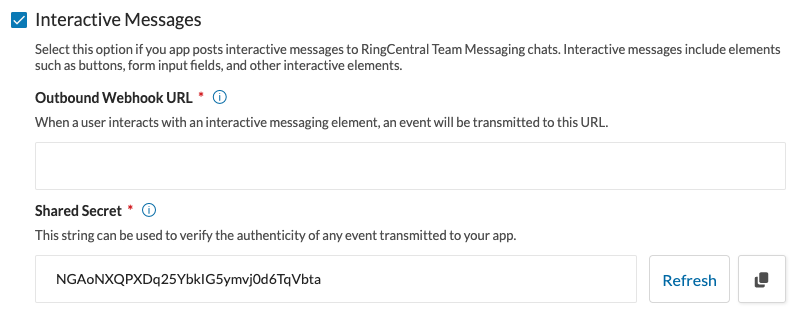
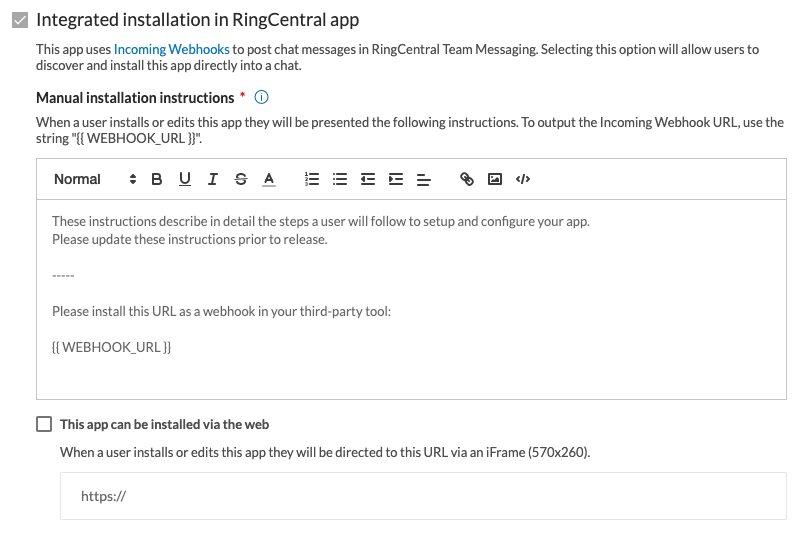

# Building a RingCentral Add-in

A RingCentral Add-in is a specialized app type intended to help developers deliver messages to the teams into which these apps are installed, in response to events and triggers that happen outside of RingCentral.

A simple example of an add-in that most developers can quickly grok is the Github app that posts a message to team whenever a pull request is submitted to a github respository.

## Add-in features

1. Add-ins are promoted directly within RingCentral's desktop client to help customers find and install them. 
2. Add-ins optionally post interactive message elements allowing users to take action directly on a message without ever having to leave the RingCentral app. 
3. Add-ins can optionally provide users with the means to install the app from within the RingCentral desktop client via an embedded iframe.

## Creating an add-in

When creating an app, first select the "RingCentral Add-in" app type. 

Creating an add-in is identical in most respects to [creating an app](../../../basics/create-app/) of any other type. Add-ins do however have a few additional fields that need to be populated by the developer in order to deliver their functionality as designed and intended. 

### App preferences

Please provide a display name and app icon for your add-in, as they are required fields. The values provided here will help attribute the messages posted by your app.

### Interactive messages

If your add-in will support interactive messages, specifically it will make use of the `Action.Submit` element, then you will need to enable the "Interactive Messages" feature for your app. Be sure to specify an outbound webhook URL for your app so that RingCentral can deliver events to your app. 

### Integrated installation

The "Integrated installation in RingCentral app" is automatically enabled for RingCentral add-ins. At a minimum, you must provide manual installation instructions so that users know how to install your add-in properly. If the [installation process can be automated](./installation/), we recommend doing so. 

Preferences include:

* **Manual installation instructions** - this text will appear when a user elects to read the "manual installation instructions" associated with your app.
* **Web-based installation** - if your app supports the customer's ability to setup/configure your app via the web, enter the URL to that flow in this field. See [Automating App Setup](./installation/).

#### Using `{{ WEBHOOK_URL }}` in your manual installation instructions

Setting up an add-in requires a customer to register a special URL generated by the RingCentral platform with a third-party service. That service will then deliver messages to that URL for processing. This URL will be inserted into your manual installation instructions by replacing the string `{{ WEBHOOK_URL }}` with a UI element that will make it easy for users to copy the URL to their clipboard.

Depending upon the service being integration with, you may not want the webhook URL rendered with a form element and a copy-to-clipboard button. To support other use cases, we support the following additional syntaxes.

| Syntax | Output |
|-|-|
| `{{ WEBHOOK_URL }}` | The URL adorned with HTML to render a copy-to-clipboard button. |
| `{{ WEBHOOK_URL raw }}` | The original URL in plain text. |
| `{{ WEBHOOK_URL id_only }}` | The webhook ID, e.g. "3053f6cf-b6de-418c-xxxx-2eb222cdab4e" |
| `{{ WEBHOOK_URL base}}` | The base URL of the webhook, e.g. "https://hooks.glip.com/webhook/v2" |

