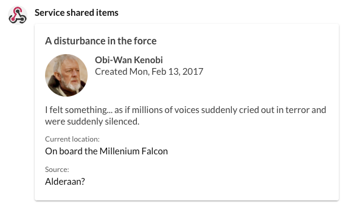

# Testing incoming webhooks using cURL

A simple way to test an incoming webhook and to make formatting messages easier is to use a simple command-line tool called cURL. Using this simple technique, you can place your message contents in a stand alone file, and then post that file to the URL of an incoming webhook.

Let's begin by creating the file `test.json` using the following contents:

```json
{
    "attachments": [
	{
	    "$schema": "http://adaptivecards.io/schemas/adaptive-card.json",
	    "type": "AdaptiveCard",
	    "version": "1.0",
	    "body": [
		{
		    "type": "TextBlock",
		    "text": "A disturbance in the force",
		    "weight": "bolder",
		    "size": "medium",
		    "wrap": true
		},
		{
		    "type": "ColumnSet",
		    "columns": [
			{
			    "type": "Column",
			    "width": "auto",
			    "items": [
				{
				    "type": "Image",
				    "url": "https://www4.pictures.zimbio.com/mp/ATCkWtsLsoEl.jpg",
				    "size": "small",
				    "style": "person"
				}
			    ]
			},
			{
			    "type": "Column",
			    "width": "stretch",
			    "items": [
				{
				    "type": "TextBlock",
				    "text": "Obi-Wan Kenobi",
				    "weight": "bolder",
				    "wrap": true
				},
				{
				    "type": "TextBlock",
				    "spacing": "none",
				    "text": "Created {{DATE(2017-02-14T06:08:39Z, SHORT)}}",
				    "isSubtle": true,
				    "wrap": true
				}
			    ]
			}
		    ]
		},
		{
		    "type": "TextBlock",
		    "text": "I felt something... as if millions of voices suddenly cried out in terror and were suddenly silenced.",
		    "wrap": true
		},
		{
		    "type": "FactSet",
		    "facts": [
			{
			    "title": "Current location:",
			    "value": "On board the Millenium Falcon"
			},
			{
			    "title": "Source:",
			    "value": "Alderaan?"
			}
		    ]
		}
	    ]
	}
    ]
}
```

Then from the same directory in which you created the above file, run the following command -- being sure to use the [webhook URL you created on your own](../webhook-creation/). 

```sh
% curl -d @test.json -H 'Content-Type: application/json' \
     https://hooks.glip.com/webhook/v2/9e116c5c-xxxx-yyyy-zzzz-c12a85cd6063
```

When complete, you should see a message that looks something like this:


