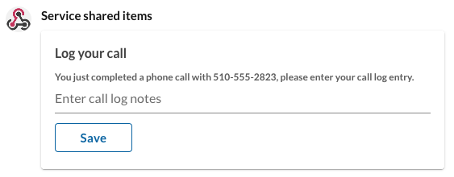

# Introduction to Team Messaging Integrations

<div class="jumbotron pt-1" markdown>
  <h2 class="h3 display-5">Getting Started with the Team Messaging API</h2>
  <p class="lead">RingCentral Team Messaging is a team collaboration solution that helps organize and centralize team communication. It is an exciting platform to develop for given the wide range of use cases, and integration possibilities.</p>
  <p>We invite all developers to try out our Team Messaging API by writing a simple app to create a team in almost no time at all. Get started using a Quick Start in any of the following languages:</p>
  [Javascript &raquo;](quick-start.md#Javascript){class="btn btn-light qs-link"}
  [PHP &raquo;](quick-start.md#PHP){class="btn btn-light qs-link"}
  [Python &raquo;](quick-start.md#Python){class="btn btn-light qs-link"}
  [Ruby &raquo;](quick-start.md#Ruby){class="btn btn-light qs-link"}
  [Java &raquo;](quick-start.md#Java){class="btn btn-light qs-link"}
  [C# &raquo;](quick-start.md#C#){class="btn btn-light qs-link"}
</div>

## What can you build using the Team Messaging API?

### Create interactive messages

Embue the messages you post with behavior, form elements and other kinds of interactivity. Allow users to enter data directly into a message and submit that data to your application.



### Build a RingCentral Add-in

RingCentral Add-ins provide developers with the means to create engaging and interactive messaging experiences that allow users to get more work done without leaving RingCentral. Add-ins can have one or more of the following capabilities:

* A fully-integrated and automated installation process. 
* Interactive messages with buttons and other calls to action.
* Embedded forms and input elements for easier data collection.

Add-ins are a perfect solution for notifying teams about keys events that happen outside of RingCentral, and then allowing those teams to take action on those events. 

### Build a bot

Bots are automated agents that users can interact with in a coversational manner. Bots are useful to:

* deliver notifications to users privately
* automate interactions with users in a conversational manner

RingCentral [supports and offers a number of Bot frameworks](manual/frameworks.md) to help developers create bot applications. To get started creating a bot, we recommend using our [Javascript Bot Framework](https://ringcentral.github.io/ringcentral-chatbot-js/) which enables developers to create a bot in 10 lines of code, like this "Ping Bot:"

```js
const createApp = require('ringcentral-chatbot/dist/apps').default

const handle = async event => {
  const { type, text, group, bot } = event
  if (type === 'Message4Bot' && text === 'ping') {
    await bot.sendMessage(group.id, { text: 'pong' })
  }
}
const app = createApp(handle)
app.listen(process.env.RINGCENTRAL_CHATBOT_EXPRESS_PORT)
```

### Integrate with project management

RingCentral Team Messaging can also be used to help with project management. In Team Messaging you can create:

* **Tasks** - manage task/to-do lists, assign tasks to others, be notified when tasks are completed
* **Events** - create and share calendar events, project due-dates, co-worker vacations and more
* **Notes** - create and share meeting notes, or maintain a scratch pad of important ideas

* Learn about the [Events API](https://developers.ringcentral.com/api-reference/Calendar-Events/listGroupEvents)
* Learn about the [Tasks API](https://developers.ringcentral.com/api-reference/Tasks/listChatTasks)
* Learn about the [Notes API](https://developers.ringcentral.com/api-reference/Notes/listChatNotes)

