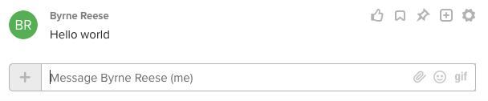

# Posting simple text messages via the API

To learn how to post a message to a RingCentral chat, let's start with the ubiquitous example: Hello World. To post a message via the API, one must first know the ID of the chat they wish to post to. Let's assume for now that you know the chat ID that you intend to post to.

## How to post a simple text message to a chat

With a chat ID in hand, posting is done with a simple REST API call, shown below.

```javascript
{! code-samples/team-messaging/post-text-message.js [ln:35-] !}
```

The code above will result in a chat message that appears as follows:



!!! tip "Did you know that you can also post via an incoming webhook?"
    [Incoming webhooks](../incoming-webhooks/webhook-creation/) provide an alternative conduit by which messages can be posted to a team. An incoming webhook's URL can be input into a third-party service provider to allow them to post event messages into a team on your behalf.

## Finding a safe and private chat ID in which to do development

In the example above, we assume that you know the chat ID you want to post a message into. But what do you do if you don't know a chat ID off the top of your head? To help you find an appropriate chat ID to post to regardless of the environment or account you may be running within, we take advantage of a type of chat every RingCentral user has but may not know about: one's "personal" chat.

Every user within RingCentral has a permanent and unique chat that is accessible exclusively by that user. This chat is in fact a chat with a single member: you. This is an ideal chat to post to for development and testing because it is easily discoverable regardless of the environment you may be operating in, and any messaging traffic you generate there will not interfere with anyone else.

The code sample below queries the Chats endpoint for the chat of type "Personal." The chat ID associated with that chat will be found in the response. 

```javascript
{! code-samples/team-messaging/get-personal-chat.js [ln:12-] !}
```

## Posting cards via the REST API

!!! warning "You cannot post adaptive cards via an attachment"
    There are dedicated endpoints for [posting adaptive cards to a team](./cards/). If you include an adaptive card as an attachment to a simple text message, you will receive an error. 
