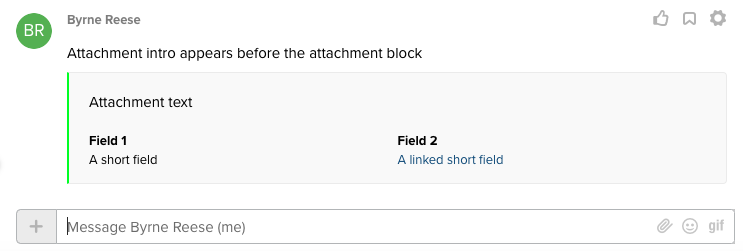

# Introduction to posting messages

## Posting methodologies

Arguable one of the most critical functions a team messaging app can perform is the act of posting a message. Messages can be posted using one of the following methods. Choose the method that is the best for your application. 

### Posting via the REST API

To [post a message via the REST API](./rest-api/) a developer composes a request to the [Create Post endpoint](https://developers.ringcentral.com/api-reference/Posts/createGlipPost) with the message payload. This method requires the developer to know the ID of the chat they are posting to prior to sending the post request.

### Posting via an Incoming webhook

An incoming webhook is a URL generated by RingCentral to make posting messages to a specific chat much easier. They are also a common way to integrate with third-party services that have the means of performing an HTTP POST as a means of integration. No authentication is required when [posting a message via an incoming webhook URL](../incoming-webhooks/posting/).

## Posting a simple text message

Posting a simple text message has a very simple structure, as shown in the sample message below. 

```json
{
   "text": "Hello World"
}
```

To post the message above, a developer needs only to specify the chat ID they want to post the message to as shown in the following code sample:

```javascript
{! code-samples/team-messaging/post-text-message.js [ln:35-] !}
```

## Posting richly-formatted content

A [card](../attachments/) provides an efficient way of posting structured content into any RingCentral chat. Cards are often used by developers when integrating with third-parties in order to create a message that corresponds to an external event.

Cards are added to a simple text message through the use of an "attachment." When posting a card, the "text" element of a message is optional, as shown below.

```json
{
  "attachments": [
    {
      "type": "Card",
      "fallback": "Attachment fallback text",
      "color": "#00ff2a",
      "intro": "Attachment intro appears before the attachment block",
      "text": "Attachment text",
      "fields": [
        {
          "title": "Field 1",
          "value": "A short field",
          "style": "Short"
        },
        {
          "title": "Field 2",
          "value": "[A linked short field](https://example.com)",
          "style": "Short"
        }
      ]
    }
  ]
}
```

Posting the contents above will result in a message that appears as follows:



### Posting multiple cards simultaneously

The following is an example set of cards created by a single request containing three attachments. Each attachment results in its own card, and contains multiple fields. This example shows message attachments created through the [RingCentral Salesforce integration](https://zapier.com/apps/glip/integrations/salesforce).


