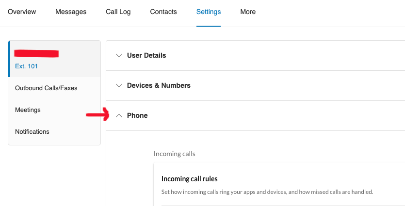
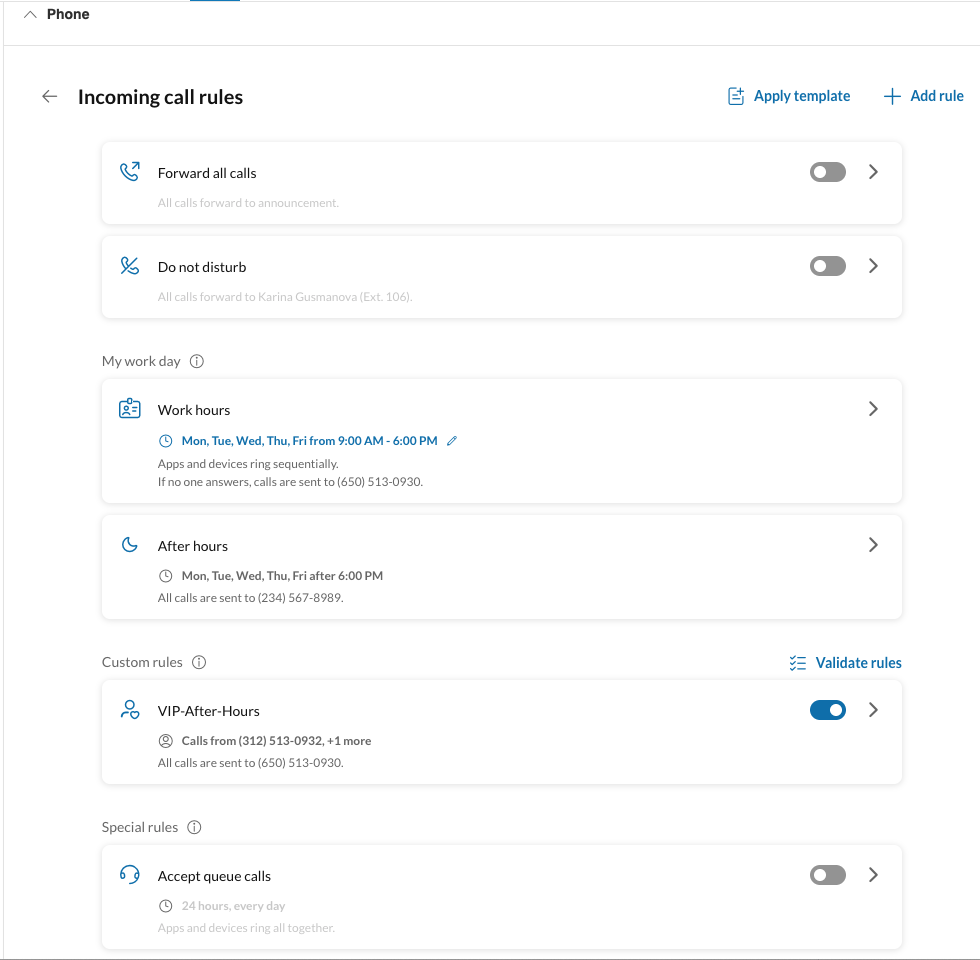

# User Call Handling

User call handling refers to a set of configurations and rules that control how incoming phone calls are managed for a specific user extension within a RingCentral RingEX account. These settings determine how calls are routed based on conditions such as time of day, day of the week, user availability, and custom-defined scenarios.

When the user is available, the system can apply:

- Greeting – Plays a customizable welcome message when a call is received.

- Connecting Audio – Plays music or a message while the call is being connected.

- Simultaneous or Sequential Ringing – Rings multiple devices either simultaneously or in a fixed order (e.g., desk phone, mobile app, desktop app) to help ensure the user doesn’t miss a call.

When the user is unavailable, the system can automatically perform one of the following actions:

- Call Forwarding – Redirects the call to another phone number or another user extension, such as a co-worker or a call queue.

- Voicemail – Sends the call to the user's voicemail with a preset or custom greeting.

- Announcement Playback – Plays a pre-recorded message and then ends the call.

This functionality allows users to tailor their call handling experience, ensuring that important calls are managed efficiently and in alignment with business workflows or personal preferences.

RingCentral users can set their call handling configuration via their RingCentral account's [admin portal](https://service.ringcentral.com). Or from the [RingCentral app](https://app.ringcentral.com) at "Settings" -> "Phone" -> "Incoming call rules" page.

User can add and change call handling rules from their admin portal:

## User Call Handling Configuration Types

RingCentral's user call handling settings are divided into two main categories: state-based and custom (interaction-based) configurations. These configuration types define how incoming calls are routed based on predefined or user-defined conditions.

### State-Based Configurations

State-based configurations are system-defined and include the following five states:

- **Forward-All-Calls**
- **Do-Not-Disturb** (DND)
- **Work-Hours**
- **After-Hours** (if the Work-Hours schedule is defined different than 24/7)
- **Agent** (if the user is a member of a call queue)

These states are automatically created and come with default call handling behavior but can be customized by the user to suit individual preferences or operational needs. All state-based rules are triggered based on the user's set time schedules, with the exception of the **Do-Not-Disturb** state, which is activated by the user's presence status (DnD).

### Custom (Interaction-Based) Configurations

Custom configurations, also known as interaction rules, allow users to define additional call handling logic based on specific matching conditions. These rules can be triggered by:

- Caller ID
- Called number
- Custom time ranges (e.g., holidays, special events)

Custom configurations offer more granular control, allowing users to tailor their call routing logic beyond the constraints of the standard state-based system.

## User Call Handling Rules

A call handling rule defines how incoming calls are managed based on specific conditions. It determines how a call is greeted and how it rings through to the user when they are available. When the user is unavailable, the rule specifies how the call should be routed—such as to voicemail, another phone number, or a recorded announcement.

Each state-based and custom (interaction-based) configuration has its own set of rules, allowing users to tailor their call handling behavior for different scenarios. This flexibility helps streamline call management and ensures a consistent caller experience.

For example, a user can assign different voicemail greetings for the Forward-All-Calls and Do-Not-Disturb states. This enables callers to receive context-aware messages, such as estimated callback times or the reason for unavailability.

## Using User Call Handling APIs

All user call handling features available in the RingCentral Admin Portal can also be managed programmatically through APIs. This allows developers to integrate call handling controls with external systems and build intelligent workflows that dynamically configure or update user call handling settings—without requiring manual adjustments in the Admin Portal.

For example, if a user's paid time off (PTO) request is approved, the system can automatically enable the "Forward-All-Calls" state and set the appropriate schedule to cover the duration of the PTO, ensuring uninterrupted call routing during their absence.

The User Call Handling APIs in RingCentral give developers powerful capabilities to programmatically manage call handling configurations for individual user extensions. These APIs allow developers to create, read, update, and delete call handling rules—also known as user answering rules—which define how and when incoming calls should be managed.

For example, a developer could configure a rule that forwards calls from VIP clients during after-hours to a mobile device, while routing all other calls to voicemail. This type of automation can significantly enhance responsiveness and customer service—particularly for use cases such as after-hours support, holiday call routing, or dynamic team scheduling.

**Use Case: Priority Routing for VIP Customers**

Let’s consider a mid-sized company, “AcmeTech,” that provides IT services to a range of clients. AcmeTech uses a CRM to manage customer information, including contract tiers, issue histories, account managers, and support SLAs. The company wants to ensure that VIP customers (those with premium support contracts) always receive expedited service when they call, even outside of regular business hours.

To achieve this, AcmeTech’s developers create an integration between their CRM and the RingCentral platform using the User Call Handling APIs. Here’s how it works:

1. CRM-Driven VIP List Generation – The CRM automatically generates a list of VIP customer phone numbers. This list is kept up to date in real-time or on a scheduled basis.

2. Programmatic Call Handling Rule Creation – Using the User Call Handling APIs, the integration creates or updates call handling rules for key support agents or managers. For example, if a VIP customer calls outside of business hours:

    - The system matches the incoming number with the VIP list.
    - The rule then forwards the call to the agent’s mobile device or backup support contact.
    - If the call is not answered within a specified duration, it may be routed to voicemail with a custom greeting or escalated to another team.

### Benefits

  - **Improved Responsiveness:** VIP and high-priority clients receive faster and more personalized responses.
  - **Automated Workflows:** Reduces the need for manual call handling configuration, saving time and ensuring consistency.
  - **Customer Context:** Incoming calls are enriched with CRM data, allowing agents to respond more effectively.
  - **Scalability:** New users and call handling scenarios can be programmatically added or modified as business needs evolve.

### Conclusion

This scenario demonstrates how the User Call Handling APIs, when paired with a CRM system, enable businesses to deliver smarter, data-driven communication workflows. By customizing the way calls are handled based on CRM insights, organizations can boost customer satisfaction, improve operational efficiency, and maintain a competitive edge in customer and agent experience.
