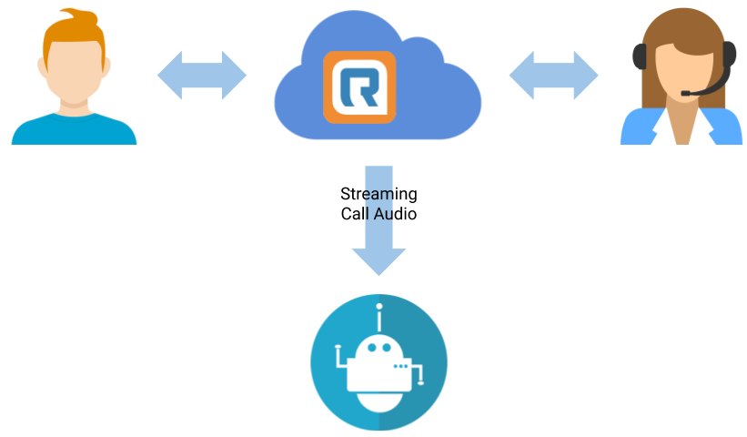

# Call Supervision, Monitoring and Streaming

[RingCentral Call Monitoring](https://www.ringcentral.com/office/features/call-monitoring/overview.html) allows a person to receive a real-time audio stream so they can listen in on a call. The primary use case is a supervisor wishing to monitor and provide feedback on an agent's performance.

The Call Monitoring API allows a developer to connect to an active phone call and subscribe to an audio stream programatically. Some use cases for this API include:

* To provide a real-time transcription of a call.
* To use NLP and AI to assist agents in helping resolve cases faster.

Partners today have used this API to provide RingCentral customers with call assistants that provide their agents with real-time suggestions to help provide customers with rapid and accurate recommendations. This scenario is visualized below. Once the call is established, the Supervision API can be used to connect an app to a call by providing:

* Call's `sessionId`
* Agent's `extensionNumber`
* Supervisor's `deviceId`



## Prerequisites

Before you begin, please verify these prerequesites are met:

1. Your RingCentral Account has the "Call Monitoring Group" feature enabled as described in this [Knowledgebase article](https://support.ringcentral.com/s/article/8050?language=en_US).

2. You have set up a "Call Monitoring Group" with Agents and Supervisors in the [Online Account Portal](https://service.ringcentral.com), or via the [RingCentral API](https://developers.ringcentral.com/api-reference#Account-Provisioning-createCallMonitoringGroup).

3. The supervisor has been configured with a SIP device, such as VoIP phone or a SIP server, that is configured to auto-answer/respond to a SIP INVITE request.

## Call Monitoring Groups

Due to the sensitive nature of Call Monitoring, authorization to be monitored and to monitor others must be specifically given to extensions within an account. To manage these permissions, a developer first creates a Call Monitoring Group, and then adds users/extensions to that group designating:

* What extensions/individuals can be monitored
* What extensions/individuals can monitor others

Once a Call Monitoring group has been configured, developers can use Telephony Session Events to receive events on calls and then use the Call Supervision API below to actively listen in on a particular call.

* [View Call Monitoring Groups documentation in the API Reference](https://developers.ringcentral.com/api-reference/Call-Monitoring-Groups/createCallMonitoringGroup)
* [Learn how to setup call monitoring in the Admin Console](https://support.ringcentral.com/s/article/8050?language=en_US)

## Subscribing to Telephony Session Events

A recommended way to receive real-time events for calls is to use [Telephony Session Notifications](telephony-session-notifications). You will need the call event's `telephonySessionId` to call the Supervision API.

You can subscribe at the account level for all extensions or specific extensions.

* [Account-Level Telephony Session Events](https://developers.ringcentral.com/api-reference/Account-Telephony-Sessions-Event)
* [User-Level Telephony Session Events](https://developers.ringcentral.com/api-reference/Extension-Telephony-Sessions-Event)

### 1) Account-Level Subscription

Subscribing for events at the account level is recommended when you are subscribing for many extensions. This approach makes it much simpler to handle the number, and dynamic nature, of monitored users.

You will need to maintain a list of extensions you have permission to monitor and then make Supervision API calls for call for a monitored user.

Attempting to make Supervision Calls for users you do not have permissions for will result in errors. You can minimize errors but still capture callss from non-synced users by attempting to Supervise Calls for users that don't exist in your synced replica.

### 2) User-Level Subscription

Subscribing for events at the user level is recommended wish you have a limited number of extensions to monitor from a large set.

In this case, retrieve the list of extensions to be monitored firts, and then maintain subscriptions for just those extensions.

### Retrieving Extension You can Monitor

You can retrieve a list of extensions your user can monitor by calling the Call Monitoring Groups API.

```
GET /restapi/v1.0/account/{accountId}/call-monitoring-groups
```

For each group in the response, call the Group Members API for the `groupId`:

```
GET /restapi/v1.0/account/{accountId}/call-monitoring-groups/{groupId}/members
```

This API returns a list of members in the `records` property. Each member has a `permissions` property which can be set to `Monitoring - User` (for supervisor) or `Monitored - User` (for agent). Filter the groups for ones your user is has the `Monitoring -User` permisssion and then collect all the `Monitored - User` extension ids for your list.

## Using the Call Supervision API

The Call Supervision API is used to have RingCentral initiate a call out to a registered device such as a VoIP phone or SIP server as follows.

### Request

The following is an example request showing the required parameters to add a supervisor to an existing call session.

=== "Raw"
	```HTTP
	POST /restapi/v1.0/account/{accountId}/telephony/sessions/{telephonySessionId}/supervise HTTP/1.1
	Content-Type: application/json
	Content-Length: ACTUAL_CONTENT_LENGTH_HERE
	Authorization: <YOUR_ACCESS_TOKEN>

	{  
	   "mode": "Listen",
	   "extensionNumber": "108",
	   "deviceId": "60727004"
	}
	```

=== "Ruby"

    ```ruby
    {!> code-samples/voice/supervision.rb !}
    ```    


#### Parameters

| Parameter | Location | Required? | Description |
|-|-|-|-|
| `accountId` | path | required | This is the unique identifier for the account associated with the request. This can be the actual id or `~` for the current `accountId`. The default `~` value is acceptable in all uses for this API. |
| `telephonySessionId` | path | required | This is the unique identifier for the call, including all parties. See the next section on how to get a list of current telephony sessions. |
| `deviceId` | body | required | This is the `deviceId` of the Supervisor's SIP device. You can get the supervisor's deviceId using the Extension device info API `/restapi/v1.0/account/~/extension/~/device` |
| `extensionNumber` | body | required | The extension number of the agent whose call you want to monitor. Note: In future we shall also support `extensionId`. |
| `mode` | body (required) | Currently, the only method supported is `Listen`. |

#### How to find the Session ID and Extension Number

The `telephonySessionId` and `extensionNumber` properties can be retrieved from any of the following:

* Call Session Notification events
* Account-level Presence API
* Extension-level Presence API.

The following example shows how to retrieve the `telephonySessionId` uses the account-level presence API. The agent extension is in the `extension.extensionNumber` property and the `telephonySessionId` is in the `activeCalls[0].telephonySessionId` property.

=== "Response"
	```json
	{
	   "uri":"https://platform.ringcentral.com/restapi/v1.0/account/809646016/extension/62226587016/presence",
	   "extension":{
	      "uri":"https://platform.ringcentral.com/restapi/v1.0/account/809646016/extension/62226587016",
	      "id":62226587016,
	      "extensionNumber":"108"
	   },
	   "presenceStatus":"Busy",
	   "telephonyStatus":"CallConnected",
	   "userStatus":"Available",
	   "dndStatus":"TakeAllCalls",
	   "meetingStatus":"Disconnected",
	   "allowSeeMyPresence":true,
	   "ringOnMonitoredCall":false,
	   "pickUpCallsOnHold":false,
	   "activeCalls":[
	      {
		 "id":"8bd930cab325416aa054238237eb8832",
		 "direction":"Inbound",
		 "fromName":"ROY,DIBYENDU",
		 "from":"+14083388064",
		 "toName":"Dibyendu Roy",
		 "to":"+12055558673",
		 "telephonyStatus":"CallConnected",
		 "sipData":{
		    "toTag":"qf-7.p-XGI9-o3D7bA3j7ihdOqfT0Z9D",
		    "fromTag":"10.13.22.25-5070-742e2a888ab14be",
		    "remoteUri":"do-not-use-me-I-am-useless",
		    "localUri":"do-not-use-me-I-am-useless"
		 },
		 "sessionId":"183851523016",
		 "startTime":"2019-03-26T22:16:29.629+0000",
		 "partyId":"cs168629785304410134536-2",
		 "telephonySessionId":"XXXXXXXXXX"
	      }
	   ]
	}
	```

=== "Request"
	```http
	GET /restapi/v1.0/account/{accountId}/presence/detailedTelephonyState=true&sipData=true
	```

#### How to find the Device ID

To retrieve the `deviceId` required by this API, call the `extension/device` endpoint on the supervisor's extension as follows:

=== "Response"
	```json
	{
	   "uri":"https://platform.ringcentral.com/restapi/v1.0/account/809646016/device/60727004",
	   "id":"60727004",
	   "type":"SoftPhone",
	   "sku":"DV-1",
	   "name":"Softphone - Digital Line",
	   "serial":"LMRC8531",
	   "computerName":"LMRC8531",
	   "status":"Online",
	   "extension":{
	      "uri":"https://platform.ringcentral.com/restapi/v1.0/account/809646016/extension/809646016",
	      "id":809646016,
	      "extensionNumber":"101"
	   }
	}
	```

=== "Request"
	```http
	GET /restapi/v1.0/account/~/extension/{supervisorExtensionId}/device
	```

### Response

If the request is success, two things will happen.

1. First, the API will send a response to reflect that the supervisor has joined the agent extension with a seperate party `id`, e.g. `party-4` in this example.
2. Next, RingCentral will then send a SIP INVITE request to the supervisor's device which will signal the device to join the existing customer-agent call session automatically with auto answer.

Once those two operations are complete, the human or app supervisor will be allowed to stream the audio. Let's look at these samples below.

#### JSON Response from API

```json
{
    "direction": "Outbound",
    "from": {
        "deviceId": "60727004",
        "extensionId": "809646016",
        "name": "Supervisor ABC",
        "phoneNumber": "101"
    },
    "id": "party-4",
    "muted": false,
    "owner": {
        "accountId": "809646016",
        "extensionId": "809646016"
    },
    "standAlone": false,
    "status": {
        "code": "Answered",
        "reason": "Supervising"
    },
    "to": {
        "extensionId": "62226587016",
        "name": "Dibyendu Roy",
        "phoneNumber": "108"
    }
}
```

#### Sample SIP Invite sent to the Supervising Device

Below is a sample SIP Invite which is delivered to the supervising device. You will notice in the lines 10 and 26highlighted below the following:

* Line 10: `p-rc-api-ids` contains the supervisor's `party-id` and `session-id`
* Line 26: `p-rc-api-monitoring-ids: session-id=s-cs171841903350030962; party-id=p-cs171841903350030962-2` the party-id here is the monitored party-id.

```http hl_lines="10 26"
|||INVITE sip:18005557562*102@192.168.42.15:62931;transport=TCP;ob SIP/2.0
||||Via: SIP/2.0/TCP 10.62.192.70:5091;branch=z9hG4bK2fh25j30couuhqiscdi0.1
||||Max-Forwards: 69
||||User-Agent: RC_SIPWRP_25.111
||||From: <sip:+16505550072@10.62.192.70>;tag=10.62.25.111-5070-6ce1264681244a
||||To: <sip:18005557562*102-c4giuv3vhjebe@192.168.12.3;ob>
||||Contact: <sip:+16508370072@10.62.192.70:5091;transport=tcp>
||||Call-ID: 198dd3ed335a4cc7832979c3065bb2a7
||||CSeq: 31268 INVITE
||||p-rc-api-ids: party-id=cs171841903350030962-6;session-id=s-cs171841903350030962
||||p-rc-api-monitoring-ids: session-id=s-cs171841903350030962; party-id=p-cs171841903350030962-2
||||Alert-Info: Auto Answer
||||Call-Info: <KyOAG0RTd5fP1WkxMAuXNw..>;purpose=info;Answer-After=0
||||Allow: SUBSCRIBE, NOTIFY, REFER, INVITE, ACK, BYE, CANCEL, UPDATE, INFO
||||Supported: replaces, timer, diversion
||||Session-Expires: 14400;refresher=uac
||||Min-SE: 90
||||Content-Type: application/sdp
||||Content-Length: 510
||||P-Acme-VSA: 200:KyOAG0RTd5fP1WkxMAuXNw..
||||v=0
||||o=- 137800156 2016517757 IN IP4 10.62.192.70
||||s=SmcSip
||||c=IN IP4 10.62.192.70
||||t=0 0
||||m=audio 50400 RTP/AVP 111 9 0 18 96 8 109 101
||||i=Y3MxNzE4NDE5MDMzNTAwMzA5NjJAMTAuNjIuMjUuMTEx party-id=cs171841903350030962-7
||||a=rtpmap:111 OPUS/48000/2
||||a=fmtp:111 useinbandfec=1
||||a=rtcp-fb:111 ccm tmmbr
||||m=audio 50402 RTP/AVP 111 9 0 18 96 8 109 101
||||i=Y3MxNzE4NDE5MDMzNTAwMzA5NjJAMTAuNjIuMjUuMTEx party-id=cs171841903350030962-8
||||a=rtpmap:111 OPUS/48000/2
||||a=fmtp:111 useinbandfec=1
||||a=rtcp-fb:111 ccm tmmbr
||||a=sendrecv
```

#### How to verify the Supervisor has joined the session

To verify that the supervisor has joined the call use the account-level Presence API to see that an additional party has been added to the existing session. Then verify that the supervisor's party is in the `activeCalls` property. For example:

=== "Response"
	```json
	{
	   "activeCalls":[
	      {
		 "id":"aa97ce30b90441158a421ca0e9c0a233",
		 "direction":"Outbound",
		 "fromName":"Supervisor ABC",
		 "from":"101",
		 "toName":"Agent",
		 "to":"108",
		 "telephonyStatus":"CallConnected",
		 "sipData":{
		    "toTag":"I2rPJdYwDjuEeOFJpT2pDszuCrepqQsL",
		    "fromTag":"10.14.23.50-5070-a272ac7ba84b4a7",
		    "remoteUri":"do-not-use-me-I-am-useless",
		    "localUri":"do-not-use-me-I-am-useless"
		 },
		 "sessionId":"590506730017",
		 "startTime":"2019-03-27T19:14:22.564+0000",
		 "partyId":"party-4",
		 "telephonySessionId":"XXXXXXXXXX"
	      }
	   ]
	   ...
	}
	```

=== "Request"
	```http
	GET /restapi/v1.0/account/{accountId}/presence?detailedTelephonyState=true&sipData=true
	```

!!! note "FCC Compliance"
    If you intend to save the audio stream, please make sure you comply with the FCC guidelines by letting the customer know that the calls will be monitored. The following [video](https://vimeo.com/326948521) demonstrates a working example of the Supervision API using the concepts described here.

## Sample Call Monitoring Application

In this simple sample application, one challenge we will be illustrating a solution for is how to monitor the call on a RingCentral soft phone. Soft phones are challenging because they utilize dynamic device IDs, as opposed to a static device ID used by physical hard phones.

In this example we will cover the following topics:

1. Getting setup
2. Obtaining the device ID of the supervisors soft phone
3. Setting up the supervisors device for monitoring
4. Detecting an incoming call
5. Invoking the Call Supervision API

### Setup

This sample application is written in NodeJS. Let's make sure you have installed the necessary prerequisites.

```js
import RingCentral from '@ringcentral/sdk'
import Subscriptions from '@ringcentral/subscriptions'
import Speaker from 'speaker'
import { nonstandard } from 'wrtc'
import Softphone from 'ringcentral-softphone'
import fs from 'fs'
```

### Obtain the soft phone's device ID

A soft phone does not have a static device ID. Therefore, we must first use one of the following methods to obtain the supervisor's device ID.

1. Get the devices attached to an extension using the [Get Devices API](https://developers.ringcentral.com/api-reference/Devices/listExtensionDevices).

2. Use the SIP Registration API to get the device ID at the time of SIP registration. We have used the SDK that already incorporates this API call, so you don’t need to handle the request/response separately. The piece of code that does this for you is below

Code for Softphone Registration using RingCentral SDK

```js
(async () => {
    await rc.login({
        username: process.env.RINGCENTRAL_USERNAME,
        extension: process.env.RINGCENTRAL_EXTENSION,
        password: process.env.RINGCENTRAL_PASSWORD
    })
    const softphone = new Softphone(rc)
    await softphone.register()
})
```

!!! tip "Getting the device ID of a hard phone"
    Generally speaking, the process of using a hard phone, a.k.a. BYOD, is the same. However, an API call is not necessary to obtain the device ID of the supervisors phone. Learn how to [setup a third-party device on the RingCentral network](https://support.ringcentral.com/s/article/4966?language=en_US) and obtain a fixed device ID.

### Prepare agent extension(s) for monitoring

Let's assume you have a prepared list of extensions that you would like to monitor. We would like to be notified when a call begins on one of those extensions so that we can listen in. Let's setup some PubNub subscriptions to alert us when calls begin.

```js
const r = await rc.get('/restapi/v1.0/account/~/extension')
const json = await r.json()
const agentExt = json.records.filter(ext => ext.extensionNumber === process.env.RINGCENTRAL_AGENT_EXT)[0]
const subscriptions = new Subscriptions({
    sdk: rc
})
const subscription = subscriptions.createSubscription({
    pollInterval: 10 * 1000,
    renewHandicapMs: 2 * 60 * 1000
})
subscription.setEventFilters([`/restapi/v1.0/account/~/extension/${agentExt.id}/telephony/sessions`])
```

### Respond to an incoming call

Now, when a customer calls the monitored agent/extension, our application will be alerted allowing us to trigger the Call Supervision API, which will in turn start streaming the live audio call between the agent and the customer.

```js
subscription.on(subscription.events.notification, async function (message) {
    if (message.body.parties.some(p => p.status.code === 'Answered' && p.direction === 'Inbound')) {
        await rc.post(`/restapi/v1.0/account/~/telephony/sessions/${message.body.telephonySessionId}/supervise`, {
            mode: 'Listen',
            supervisorDeviceId: softphone.device.id,
            agentExtensionNumber: agentExt.extensionNumber
        })
    }
})
```

When the Call Supervision API is invoked, the Supervisor's device (SoftPhone) accepts the SIP INVITE automatically (it was pre-configured to do that) and the agent-customer call audio is streamed in real-timne to the Supervisor's device.

In the sample code below, we take the additional step of saving the call to an audio file (`call.raw`) onto the local filesystem.

```js
softphone.on('INVITE', sipMessage => {
    softphone.answer(sipMessage)
    softphone.once('track', e => {
        const audioSink = new nonstandard.RTCAudioSink(e.track)
        let speaker = null
        let prevSampleRate = null
        const audioFilePath = 'call.raw'
        if (fs.existsSync(audioFilePath)) {
            fs.unlinkSync(audioFilePath)
        }
        const writeStream = fs.createWriteStream(audioFilePath, { flags: 'a' })
        audioSink.ondata = data => {
            console.log('live audio data received, sample rate is ', data.sampleRate)
            if (speaker === null) {
                // wait until sample rate stable
                if (data.sampleRate === prevSampleRate) {
                    speaker = new Speaker({
	                channels: data.channelCount,
                        bitDepth: data.bitsPerSample,
                        sampleRate: data.sampleRate,
                        signed: true
		    })
                }
                prevSampleRate = data.sampleRate
            } else {
                speaker.write(Buffer.from(data.samples.buffer))
                writeStream.write(Buffer.from(data.samples.buffer))
            }
        }
    }
}
```

When the call is complete, you can play the file using the following command:

`play -e signed -b 16 -r 8000 -c 1 call.raw`

### How to monitor calls using dual channel audio

The Supervision API allows for [dual channel call streaming](https://developers.ringcentral.com/api-reference/Call-Control/superviseCallParty), one channel for each of the two parties on the call. This capability is often desirable in call/contact center implementations that require access to high quality audio streams for use with voice recognition and speech transcription systems.

This capability mirrors that of the Supervision API. However, instead of accessing a stream associated with the call session, a developer would call the API once for each party on the call to access their respective streams.

=== "Raw"
	```http
	POST /restapi/v1.0/account/{accountId}/telephony/sessions/{telephonySessionId}/parties/{partyId}/supervise HTTP/1.1
	Content-Type: application/json
	Content-Length: ACTUAL_CONTENT_LENGTH_HERE
	Authorization: <YOUR_ACCESS_TOKEN>

	{  
	   "mode": "Listen",
	   "agentExtensionId": "40001234567890",
	   "supervisorDeviceId": "191888004"
	}
	```

!!! note "Server-side vs client-side device monitoring"
    If a RingCentral hard-phone or a WebRTC application is used as the monitoring device instead of a SIP server, then the agent's call is supervised first (streaming the agent audio stream). In other words, the device will receive the first SIP invite for the agent's party. The second SIP invite to monitor the customer party would not be automatically accepted by the SIP device. The first call will be put on hold and then the second call will start ringing. This is because this use case is designed for a server side device capable of accepting multiple parallel SIP invites.

### Additional Resources

* Consult the [Call Supervision Demo/Sample App](https://github.com/tylerlong/ringcentral-call-supervise-demo) for an end-to-end example app that also allows you to listen to the live audio stream, as well as saving the audio to a local file.
* Read [Automatically Supervise Your Call Agents](https://medium.com/ringcentral-developers/automatically-supervise-your-call-agents-78c0cd7caf7f) on our blog.
